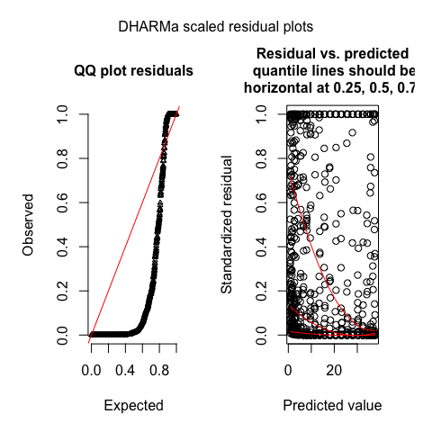
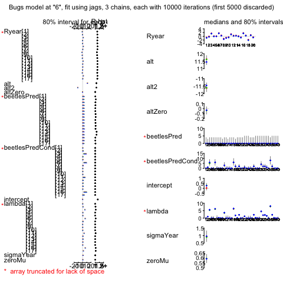

# Beetles GLMM example with DHARMa residual checks
Florian Hartig  
`r Sys.Date()`  


# Create data


```r
set.seed(123)
```

This first part creates a dataset with beetles counts across an altitudinal gradient (several plots each observed several years), with a random intercept on year and zero-inflation. 


```r
altitude = rep(seq(0,1,len = 50), each = 20)
dataID = 1:1000
spatialCoordinate = rep(seq(0,30, len = 50), each = 20)

# random effects + zeroinflation
plot = rep(1:50, each = 20)
year = rep(1:20, times = 50)

yearRandom = rnorm(20, 0, 1)
plotRandom = rnorm(50, 0, 1)
overdispersion = rnorm(1000, sd = 0.5)
zeroinflation = rbinom(1000,1,0.6)

beetles <- rpois(1000, exp( 0  + 12*altitude - 12*altitude^2 
                            #  + overdispersion   + plotRandom[plot]
                            + yearRandom[year]) * zeroinflation )

data = data.frame(dataID, beetles, altitude, plot, year, spatialCoordinate)

plot(year, altitude, cex = beetles/50, pch =2, main = "Beetle counts across altitudinal gradient\n triangle is proportional to counts")
```

<!-- -->

# Analysis and residual analysis with JAGS

Prepare analysis


```r
library(R2jags)
modelData=as.list(data)
modelData = append(data, list(nobs=1000, nplots = 50, nyears = 20))
head(data)
```

```
##   dataID beetles altitude plot year spatialCoordinate
## 1      1       0        0    1    1                 0
## 2      2       2        0    1    2                 0
## 3      3       4        0    1    3                 0
## 4      4       0        0    1    4                 0
## 5      5       0        0    1    5                 0
## 6      6       4        0    1    6                 0
```

## Fitting a basic GLM 

Note that I create here the simulated residuals via a new block at the end of the code. An alternative, more traditional, but less versatile coding option is to provide the data 2 times, but set the response the second time to NA, which will cause JAGS to simulate the empty notes. 


```r
modelstring="
model {

# Likelihood
for (i in 1:nobs) {
  lambda[i] <- exp(intercept + alt * altitude[i] + alt2 * altitude[i] * altitude[i]) 
  beetles[i]~dpois(lambda[i]) 
}

# Fixed effect priors 
intercept ~ dnorm(0,0.0001)
alt ~ dnorm(0,0.0001)
alt2 ~ dnorm(0,0.0001)

# Posterior predictive simulations 

for (i in 1:nobs) {
  beetlesPred[i]~dpois(lambda[i])
}
Prediction <- sum(beetlesPred)
}
"

model=jags(model.file = textConnection(modelstring), data=modelData, n.iter=10000,  parameters.to.save = c("intercept", "alt", "alt2", "beetlesPred", "lambda"), DIC = F)
```

```
## Warning in jags.model(model.file, data = data, inits = init.values,
## n.chains = n.chains, : Unused variable "dataID" in data
```

```
## Warning in jags.model(model.file, data = data, inits = init.values,
## n.chains = n.chains, : Unused variable "plot" in data
```

```
## Warning in jags.model(model.file, data = data, inits = init.values,
## n.chains = n.chains, : Unused variable "year" in data
```

```
## Warning in jags.model(model.file, data = data, inits = init.values,
## n.chains = n.chains, : Unused variable "spatialCoordinate" in data
```

```
## Warning in jags.model(model.file, data = data, inits = init.values,
## n.chains = n.chains, : Unused variable "nplots" in data
```

```
## Warning in jags.model(model.file, data = data, inits = init.values,
## n.chains = n.chains, : Unused variable "nyears" in data
```

Calculating Residuals


```r
library(DHARMa)
simulations = model$BUGSoutput$sims.list$beetlesPred
pred = apply(model$BUGSoutput$sims.list$lambda, 2, median)
dim(simulations)
```

```
## [1] 3000 1000
```

```r
sim = createDHARMa(simulatedResponse = t(simulations), observedResponse = data$beetles, fittedPredictedResponse = pred, integerResponse = T)
plotSimulatedResiduals(sim)
```

<!-- -->


We clearly see overdispersion in the plots (if you don't see it, read the DHARMa vignette for more explanations).


## GLMM with random intercept on year, observation-level RE for overdispersion, and zero-inflation

The following code fits a GLMM with random intercept on year, observation-level RE for overdispersion, and zero-inflation.

Note that we then created two types of posterior predictive simulations 

* Conditional posterior predictive simulations, meaning that we take the final fitted values for lampda (which includes destimates of REs and ZI), and only simulate the final Poisson distribution

* Unconditional simulations, which means that we created data from the fitted model, simulating also the REs and the ZI terms newly

Below, I demonstrate both. If we want to create fully uncoditional simulations, we can either copy the entire model structure (as done in this example), or (small trick, mentioned already above), we just make a copy of the data, merge it with the existing data, and set the response to NA - this way Jags will see sample the empty notes according to the same structure that is used to fit the data. 

Of course, with more complicated models, one can also do a part of the structure conditional, and another part unconditional. For example, here, we could have made the observation-level RE unconditional (as this is essentially a part of the distribution), but kept the REs on year and the zero-inflation conditional. 


```r
modelstring="
model {

# Likelihood
for (i in 1:nobs) {
lambda[i] <- exp(intercept + alt * altitude[i] + alt2 * altitude[i] * altitude[i] + Ryear[year[i]] + RID[i] ) * Zero[i] + 0.00000001 

beetles[i]~dpois(lambda[i]) 
}

# Fixed effect priors 
intercept ~ dnorm(0,0.0001)
alt ~ dnorm(0,0.0001)
alt2 ~ dnorm(0,0.0001)

# Random effects 

for (i in 1:nyears) {
Ryear[i]~dnorm(0,sigmaYear)
}

for (i in 1:nobs) {
RID[i]~dnorm(0,sigmaID)
}

# Variance priors 
sigmaYear~dgamma(1,2)
sigmaID~dgamma(0.001,0.001)

# Zeroinflation

for (i in 1:nobs) {
Zero[i]~dbern(zeroMu + altZero * altitude[i])
}
zeroMu ~ dunif(0,1)
altZero ~ dnorm(0,0.0001)

# Posterior predictive simulations, conditional on fitted REs  

for (i in 1:nobs) {
  beetlesPredCond[i]~dpois(lambda[i])
}
PredictionCond <- sum(beetlesPredCond)

# Posterior predictive simulations, re-simulating REs  

for (i in 1:nobs) {
  lambdaPred[i] <- exp(intercept + alt * altitude[i] + alt2 * altitude[i] * altitude[i] + RyearPred[year[i]] + RIDPred[i] ) * ZeroPred[i] + 0.00000001 
  beetlesPred[i]~dpois(lambdaPred[i]) 
}

for (i in 1:nyears) {
  RyearPred[i]~dnorm(0,sigmaYear)
}

for (i in 1:nobs) {
  RIDPred[i]~dnorm(0,sigmaID)
}

for (i in 1:nobs) {
  ZeroPred[i]~dbern(zeroMu + altZero * altitude[i])
}

Prediction <- sum(beetlesPred)

}
"

model=jags(model.file = textConnection(modelstring), data=modelData, n.iter=10000,  parameters.to.save = c("intercept", "alt", "alt2", "beetlesPred", "beetlesPredCond", "Ryear", "sigmaYear", "lambda", "altZero", "zeroMu"), DIC = F)
```

```
## Warning in jags.model(model.file, data = data, inits = init.values,
## n.chains = n.chains, : Unused variable "dataID" in data
```

```
## Warning in jags.model(model.file, data = data, inits = init.values,
## n.chains = n.chains, : Unused variable "plot" in data
```

```
## Warning in jags.model(model.file, data = data, inits = init.values,
## n.chains = n.chains, : Unused variable "spatialCoordinate" in data
```

```
## Warning in jags.model(model.file, data = data, inits = init.values,
## n.chains = n.chains, : Unused variable "nplots" in data
```

```r
plot(model)
```

<!-- -->


```r
library(DHARMa)

# Conditional

simulations = model$BUGSoutput$sims.list$beetlesPredCond
pred = apply(model$BUGSoutput$sims.list$lambda, 2, median)
dim(simulations)
```

```
## [1] 3000 1000
```

```r
sim = createDHARMa(simulatedResponse = t(simulations), observedResponse = data$beetles, fittedPredictedResponse = pred, integerResponse = T)
plotSimulatedResiduals(sim)
```

<!-- -->

Now the plots for the unconditional - note that there is now a bit of underdispersion, although we have the correct model.

I think the reason is the following. The quantile residuals should be assymptotically flat (i.e. for a sharp posterior on the true values), but they don't neccessarily have these properties for wide posteriors that may additionally still show prior influences. I'm sorry that I can't give a more general explanation of this at the moment, I also think this topic is generally not well researched. I doubt, what I would do is to create a new dataset based on the MAP and refit it, to see if the observed residual pattern is expected for the model structure, together with the priors. 


```r
simulations = model$BUGSoutput$sims.list$beetlesPred
pred = apply(model$BUGSoutput$sims.list$lambda, 2, median)
dim(simulations)
```

```
## [1] 3000 1000
```

```r
# Here I change fittedPredictedResponse because it doesn't make sense to plot the unconditional residuals against the conditional predictions
sim = createDHARMa(simulatedResponse = t(simulations), observedResponse = data$beetles, fittedPredictedResponse = log(apply(simulations, 2, mean) + 1), integerResponse = T)
plotSimulatedResiduals(sim)
```

<!-- -->

