```r
library(DHARMa)
```

```
## This is DHARMa 0.3.2.0. For overview type '?DHARMa'. For recent changes, type news(package = 'DHARMa') Note: Syntax of plotResiduals has changed in 0.3.0, see ?plotResiduals for details
```

```r
library(lme4)
```

```
## Loading required package: Matrix
```

```r
library(glmmTMB)
```

# DHARMa function overview

Let's fit a correctly a correctly specified model (we know it's correct because we simulated the data ourselves)


```r
set.seed(123)
testData = createData(sampleSize = 200, family = poisson())
fittedModel <- glmer(observedResponse ~ Environment1 + (1|group), 
                     family = "poisson", data = testData)
```

## Calculating residuals with DHARMa


```r
res <- simulateResiduals(fittedModel)
```

Large number of options, see help and more comments later

## The main DHARMa residual plot


```r
plot(res)
```

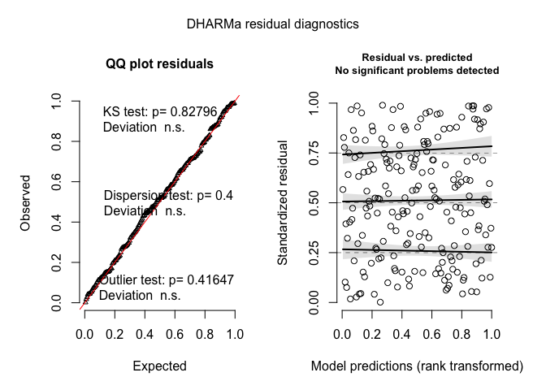<!-- -->

Interpretation of the left panel:

* Uniform QQ plot (interpret like standard R plots)
* KS-test for uniformity (essentially the same info as QQ)
* Dispersion test: compares the variance in observations to the variance of the simulations
* Outlier tests: tests if the number of outliers (i.e. observations outside the simulation envelope) is larger / smaller than one would expect under H0

Interpretation of the right panel:

* res ~ predicted (we would expect a completely uniform distribution in y direction, if rank-transformed also in x direction)
* quantile GAMs fitted on the residuals at 0.25, 0.5, 0.75. If those GAMs deviate significantly from a straigt line at those values, they will be highlighted

## Available tests

We can also run these tests separately, including a few further test that I show below


```r
testDispersion(res)
```

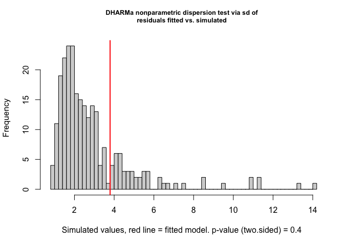<!-- -->

```
## 
## 	DHARMa nonparametric dispersion test via sd of residuals fitted
## 	vs. simulated
## 
## data:  simulationOutput
## ratioObsSim = 1.3166, p-value = 0.4
## alternative hypothesis: two.sided
```

```r
testUniformity(res)
```

<!-- -->

```
## 
## 	One-sample Kolmogorov-Smirnov test
## 
## data:  simulationOutput$scaledResiduals
## D = 0.044272, p-value = 0.828
## alternative hypothesis: two-sided
```

```r
testOutliers(res)
```

<!-- -->

```
## 
## 	DHARMa outlier test based on exact binomial test
## 
## data:  res
## outliers at both margin(s) = 0, simulations = 200, p-value =
## 0.4165
## alternative hypothesis: true probability of success is not equal to 0.007968127
## 95 percent confidence interval:
##  0.00000000 0.01827534
## sample estimates:
## frequency of outliers (expected: 0.00796812749003984 ) 
##                                                      0
```

```r
testQuantiles(res)
```

<!-- -->

```
## 
## 	Test for location of quantiles via qgam
## 
## data:  simulationOutput
## p-value = 0.4287
## alternative hypothesis: both
```

```r
testZeroInflation(res)
```

<!-- -->

```
## 
## 	DHARMa zero-inflation test via comparison to expected zeros with
## 	simulation under H0 = fitted model
## 
## data:  simulationOutput
## ratioObsSim = 0.95266, p-value = 0.864
## alternative hypothesis: two.sided
```

```r
testSpatialAutocorrelation(res)
```

```
## DHARMa::testSpatialAutocorrelation - no x coordinates provided, using random values for each data point
## DHARMa::testSpatialAutocorrelation - no x coordinates provided, using random values for each data point
```

<!-- -->

```
## 
## 	DHARMa Moran's I test for spatial autocorrelation
## 
## data:  res
## observed = -0.0085020, expected = -0.0050251, sd = 0.0088429,
## p-value = 0.6942
## alternative hypothesis: Spatial autocorrelation
```

```r
testTemporalAutocorrelation(res)
```

```
## DHARMa::testTemporalAutocorrelation - no time argument provided, using random times for each data point
```

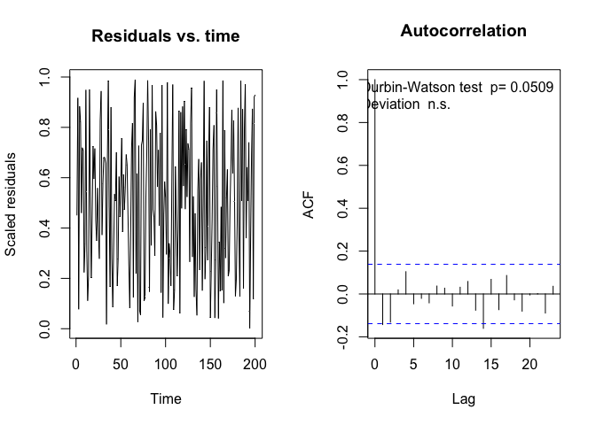<!-- -->

```
## 
## 	Durbin-Watson test
## 
## data:  simulationOutput$scaledResiduals ~ 1
## DW = 2.2747, p-value = 0.0509
## alternative hypothesis: true autocorrelation is not 0
```

testDispersion and testZeroinflation are actually convenience wrappers derived from a more general function that allows testing an the simulated data, summarized by arbitrary summary statistics, against the observed data. 

To test, for example, if the simulated mean observation deviates from the observed mean, use.


```r
testGeneric(res, summary = mean)
```

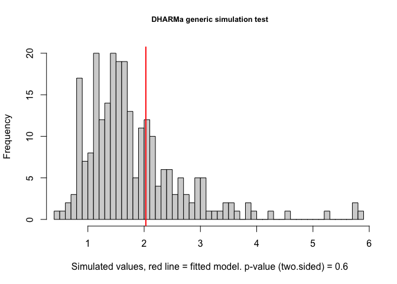<!-- -->

```
## 
## 	DHARMa generic simulation test
## 
## data:  res
## ratioObsSim = 1.1181, p-value = 0.6
## alternative hypothesis: two.sided
```

This function corresponds to what is traditionally discussed as the "Bayesian p-value" in the statistical literature, i.e. you create one p-value for the entire model-data comparison, as opposed to essentially a p-value per residual. 

Something in between is offered by the recalculateResidual() function


```r
res2 = recalculateResiduals(res, group = testData$group)
plot(res2)
```

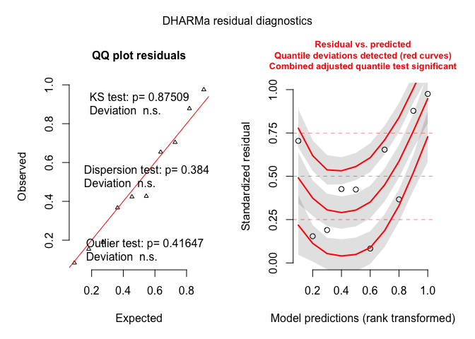<!-- -->

where simulated and observed data a first summed by group before calculating the quantiles. It is useful for plotting residuals per site, location, individual etc., and in many case (in particular binomial, see example later), other patterns will occur after grouping. 

## More S3 functions

A few more useful functions, for complete list see help


```r
hist(res)
```

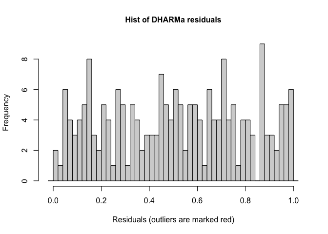<!-- -->

```r
residuals(res)
```

```
##   [1] 0.59644271 0.65351923 0.38451184 0.32440363 0.44462613 0.34560395
##   [7] 0.12945206 0.72681164 0.23422189 0.24967565 0.67384277 0.61682025
##  [13] 0.04129225 0.56521285 0.22418958 0.19710512 0.50789523 0.70967282
##  [19] 0.69191773 0.39446710 0.35004535 0.51908366 0.71406720 0.38261745
##  [25] 0.05302880 0.52604688 0.70118796 0.15223678 0.55840384 0.45015142
##  [31] 0.51915187 0.75703953 0.45296765 0.27591381 0.26627260 0.56353544
##  [37] 0.74020195 0.15632878 0.04273574 0.43396420 0.74702813 0.48147574
##  [43] 0.22830859 0.50750651 0.05486810 0.08625624 0.57748403 0.12846837
##  [49] 0.07738590 0.14722509 0.43038919 0.35955253 0.52221703 0.01749923
##  [55] 0.44833743 0.19406431 0.47521337 0.16682060 0.47314152 0.33662714
##  [61] 0.27680678 0.29723768 0.56164287 0.65751021 0.65838360 0.51846929
##  [67] 0.27305656 0.06173136 0.30697546 0.23056024 0.63230712 0.44389058
##  [73] 0.28964334 0.28508318 0.16962125 0.11712456 0.14369378 0.56678315
##  [79] 0.52386049 0.07107557 0.66779683 0.04323629 0.09901662 0.68984333
##  [85] 0.21161970 0.04484628 0.15231360 0.27193889 0.45715669 0.28120354
##  [91] 0.49015142 0.47289468 0.49888975 0.45300560 0.02726551 0.37267475
##  [97] 0.21931033 0.40289516 0.86990443 0.15148144 0.68076439 0.78873352
## [103] 0.79215034 0.86320341 0.73655344 0.69195809 0.80811525 0.74705757
## [109] 0.71299369 0.17058992 0.67981490 0.81682725 0.61201024 0.88231205
## [115] 0.40937426 0.48394191 0.72492127 0.87927473 0.41634186 0.11160081
## [121] 0.58475101 0.42927196 0.54609734 0.32211869 0.33097072 0.20141392
## [127] 0.36492318 0.10207141 0.12667672 0.71920675 0.12223310 0.11161653
## [133] 0.08237840 0.12517077 0.64148776 0.20915202 0.15924171 0.35490467
## [139] 0.14956175 0.00142415 0.58990140 0.29523925 0.70799284 0.82123286
## [145] 0.61608641 0.33914978 0.20868535 0.53420130 0.64372751 0.66025424
## [151] 0.87732743 0.86023443 0.79686245 0.72894171 0.27804493 0.58381989
## [157] 0.50858265 0.65159741 0.58467018 0.82733642 0.75003619 0.89614659
## [163] 0.47841151 0.88398252 0.94413466 0.82993465 0.46021562 0.60390634
## [169] 0.79224524 0.91980957 0.94944130 0.87150384 0.71588688 0.86598158
## [175] 0.90494358 0.87371449 0.52559451 0.77818727 0.80796228 0.71688534
## [181] 0.96983014 0.92933540 0.98539177 0.98406375 0.98607365 0.81420594
## [187] 0.98955211 0.94848094 0.97808765 0.95772333 0.92061195 0.96727241
## [193] 0.97102925 0.95084070 0.98574510 0.98645418 0.87969857 0.96760594
## [199] 0.91681331 0.07518005
```

```r
plotResiduals(res, form = testData$Environment1)
```

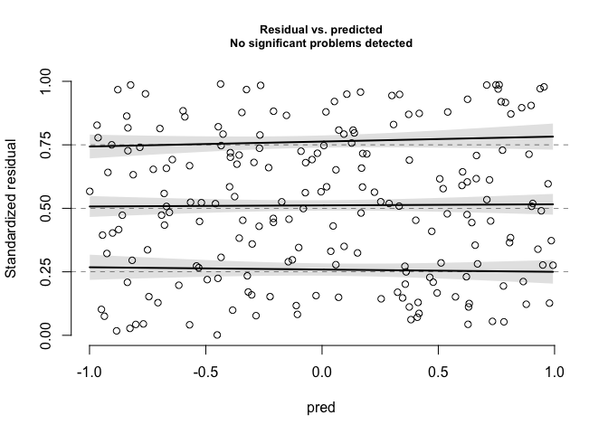<!-- -->

## Examples of possible problems 

Removing the RE will create overdispersion


```r
set.seed(123)
testData = createData(sampleSize = 200, family = poisson())
fittedModel <- glm(observedResponse ~ Environment1 , 
                     family = "poisson", data = testData)

res <- simulateResiduals(fittedModel = fittedModel)
plot(res)
```

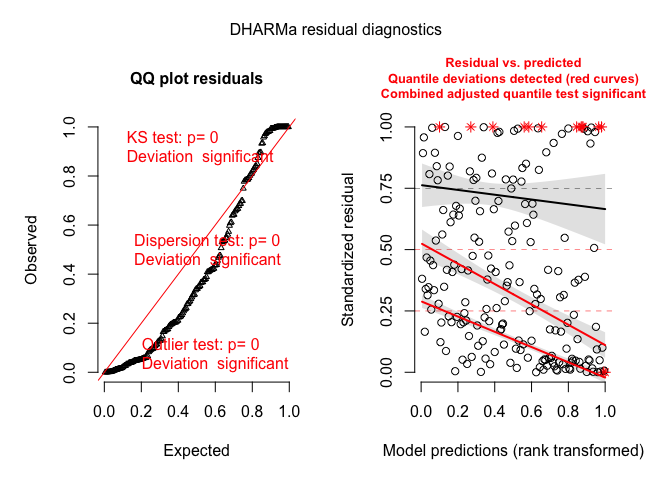<!-- -->

Missing an important predictor creates surprisingly few problems in the overall diagnostics 


```r
set.seed(123)
testData = createData(sampleSize = 200, family = poisson())
fittedModel <- glmer(observedResponse ~ 1 + (1|group), 
                     family = "poisson", data = testData)

res <- simulateResiduals(fittedModel = fittedModel)
plot(res)
```

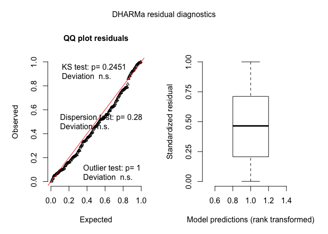<!-- -->

but if we plot residuals against the predictor, we see the problem clearly


```r
plotResiduals(res, form = testData$Environment1)
```

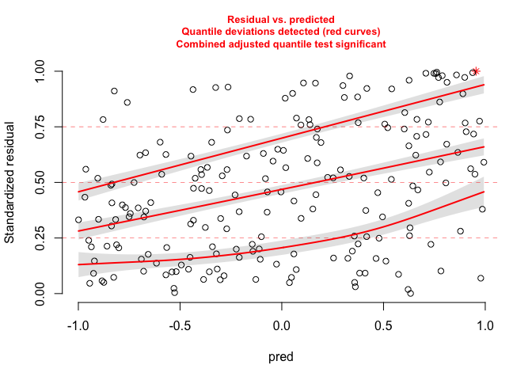<!-- -->

Conclusion: always additionally check residuals against all predictors!

# Owl example

The data is from Roulin, A. and L. Bersier (2007) Nestling barn owls beg more intensely in the presence of their mother than in the presence of their father. Animal Behaviour 74 1099–1106. https://doi.org/10.1016/j.anbehav.2007.01.027


```r
library(glmmTMB)
plot(SiblingNegotiation ~ FoodTreatment, data=Owls)
```

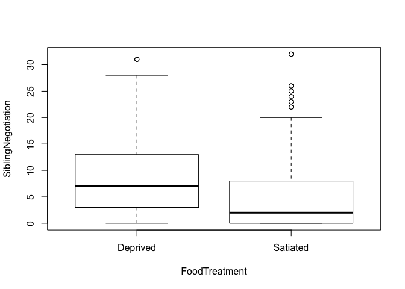<!-- -->

Fitting the scientific hypothesis (offset corrects for BroodSize)


```r
m1 <- glm(SiblingNegotiation ~ FoodTreatment*SexParent + offset(log(BroodSize)), data=Owls , family = poisson)
```

Just as a bad example, let's look again at the standard residuals


```r
plot(m1)
```

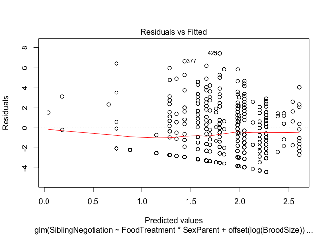<!-- -->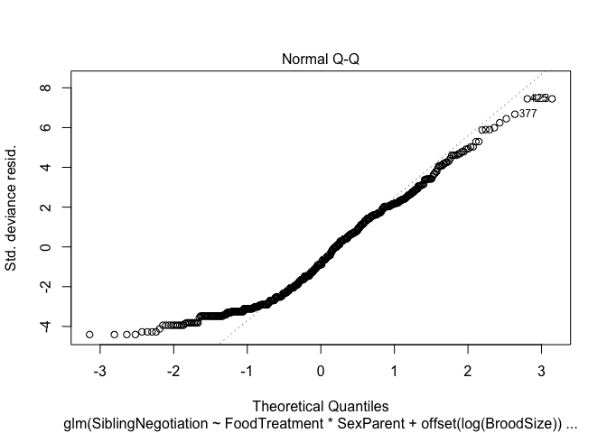<!-- -->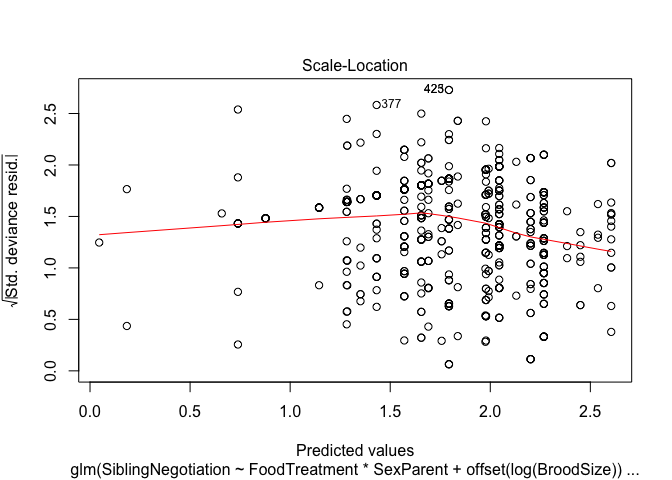<!-- -->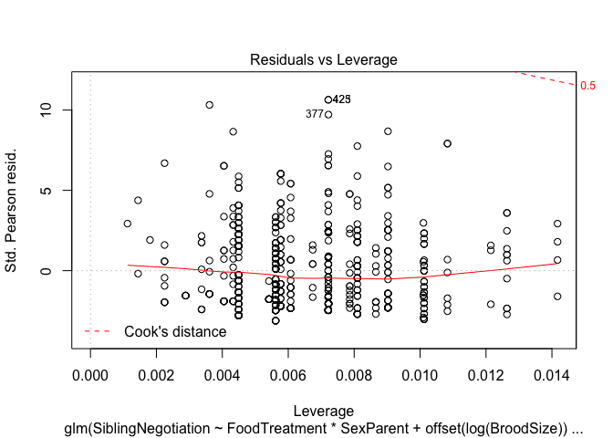<!-- -->

Calculating DHARMa residuals


```r
res <- simulateResiduals(m1)
plot(res)
```

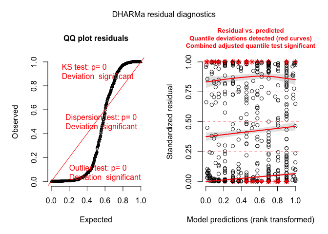<!-- -->

Adding a random effect on Nest


```r
m2 <- glmer(SiblingNegotiation ~ FoodTreatment*SexParent + offset(log(BroodSize)) + (1|Nest), data=Owls , family = poisson)
res <- simulateResiduals(m2)
plot(res)
```

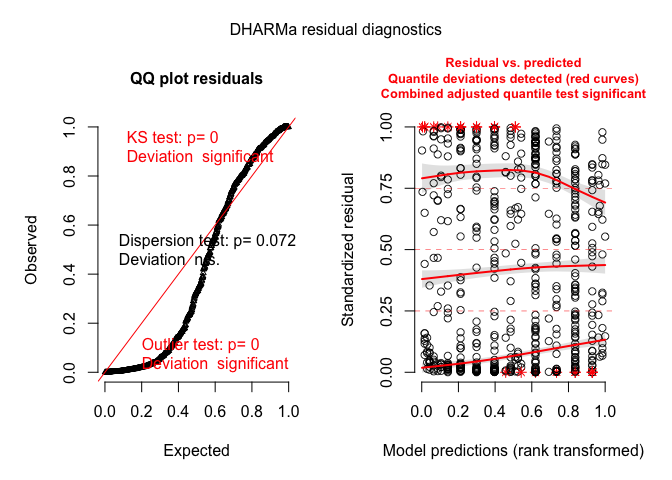<!-- -->

Switching to nbinom1 to account for overdispersion


```r
m3 <- glmmTMB(SiblingNegotiation ~ FoodTreatment*SexParent + offset(log(BroodSize)) + (1|Nest), data=Owls , family = nbinom1)

res <- simulateResiduals(m3)
plot(res)
```

<!-- -->

Something still seems wrong. Let's see if further plots will help us to get an idea of what is going on


```r
plotResiduals(res, Owls$FoodTreatment)
```

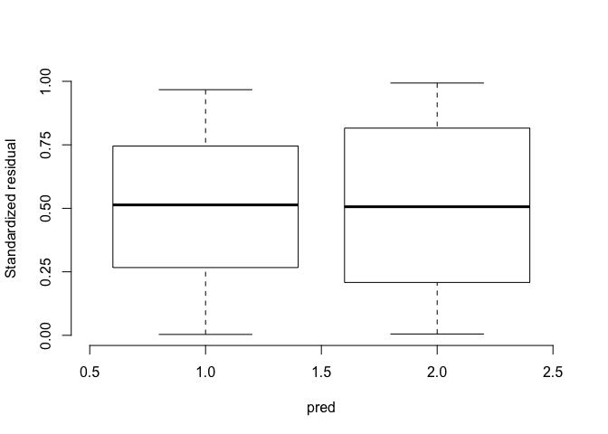<!-- -->

```r
plotResiduals(res, Owls$SexParent)
```

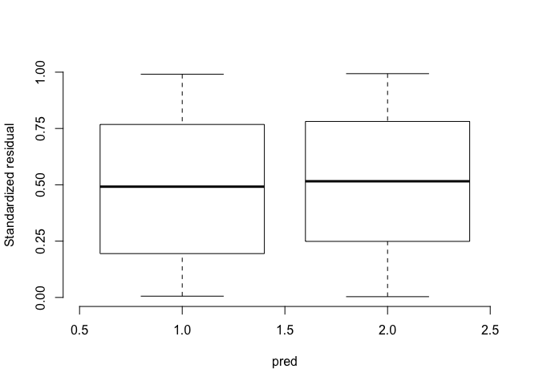<!-- -->

Nothing to see. Let's check dispersion


```r
testDispersion(res)
```

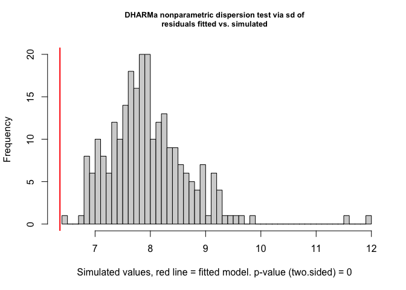<!-- -->

```
## 
## 	DHARMa nonparametric dispersion test via sd of residuals fitted
## 	vs. simulated
## 
## data:  simulationOutput
## ratioObsSim = 0.79972, p-value < 2.2e-16
## alternative hypothesis: two.sided
```

```r
testZeroInflation(res)
```

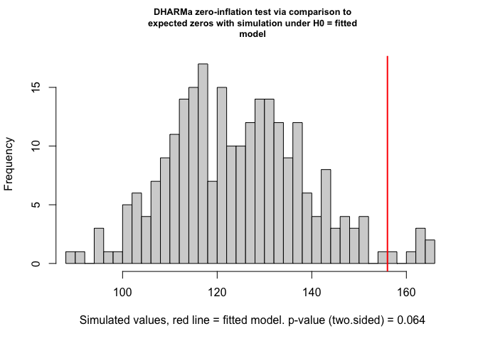<!-- -->

```
## 
## 	DHARMa zero-inflation test via comparison to expected zeros with
## 	simulation under H0 = fitted model
## 
## data:  simulationOutput
## ratioObsSim = 1.2488, p-value = 0.064
## alternative hypothesis: two.sided
```

It's a curious result that we have now underdispersion, despite fitting a model that corrects for dispersion. How can that be? Well, note taht we also seem to have a slight dendency to zero-inflation. What I have often observed in zero-inflated situations is that the model (if we fit a model with variable dispersion) will adjust for the zero-inflation by increasing the dispersion parameter, but now we have fewer larger observations than expected, thus the underdispersion. 


```r
set.seed(123)
m4 <- glmmTMB(SiblingNegotiation ~ FoodTreatment*SexParent + offset(log(BroodSize)) + (1|Nest), ziformula = ~ FoodTreatment *SexParent, data=Owls , family = nbinom1 )
res <- simulateResiduals(m4)
plot(res)
```

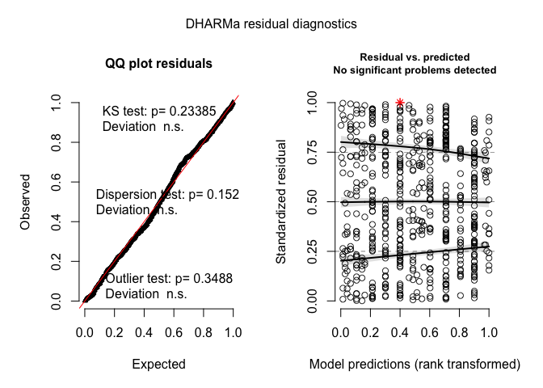<!-- -->

# Salamander example


```r
data(Salamanders)
Salamanders$pres = Salamanders$count > 0 
```

Binomial model


```r
mb1 = glm(pres ~ 0 + spp * cover, data = Salamanders, family = "binomial")
par(mfrow = c(2,2))
```

Just as a bad example, let's look again at the standard residuals


```r
plot(mb1)
```

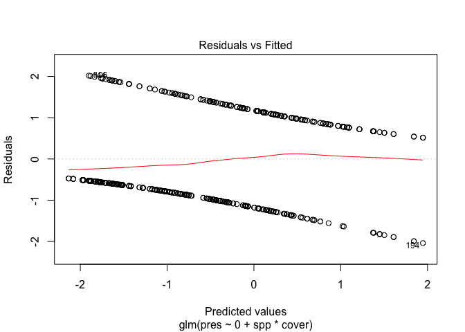<!-- -->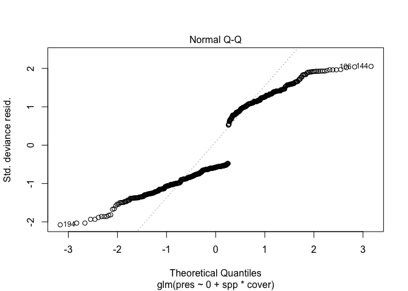<!-- -->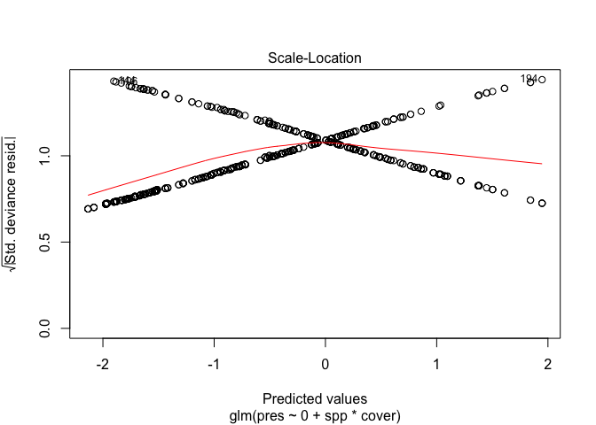<!-- -->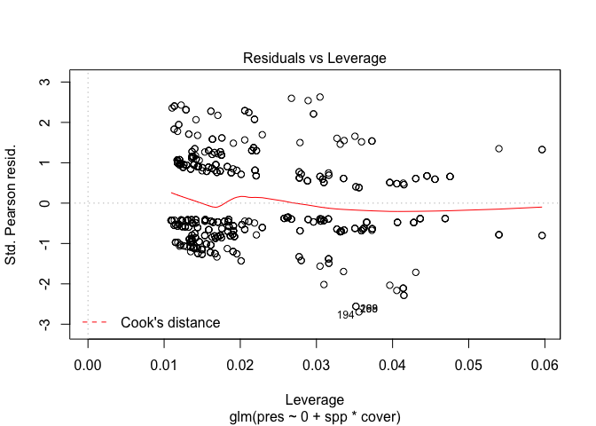<!-- -->

Calculating DHARMa residuals


```r
res <- simulateResiduals(mb1)
plot(res)
```

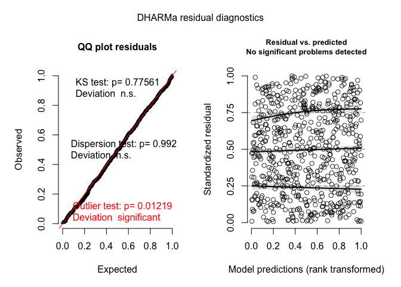<!-- -->

Looks good, but careful - binomial 0/1 models always look good when plotted per data point, e.g. it is impossible to have overdispersion for 0/1 data when plotted per data point. That often changes if we aggregate data points


```r
res2 <- recalculateResiduals(res, group = Salamanders$site)
plot(res2)
```

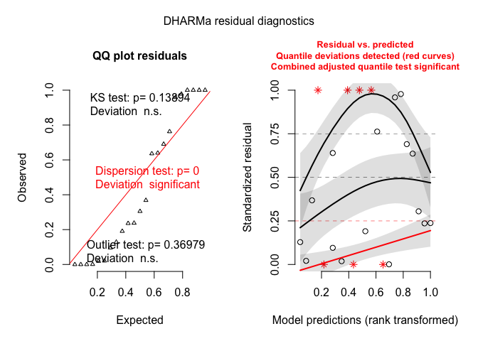<!-- -->

Aha, this looks much wose


```r
plotResiduals(res, Salamanders$mined)
```

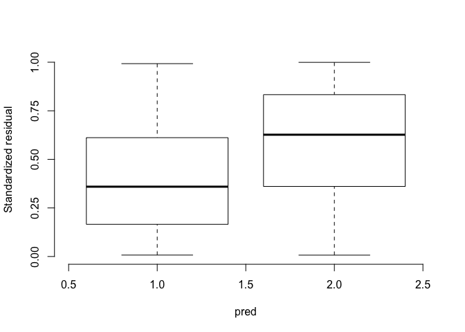<!-- -->

```r
plotResiduals(res, Salamanders$cover)
```

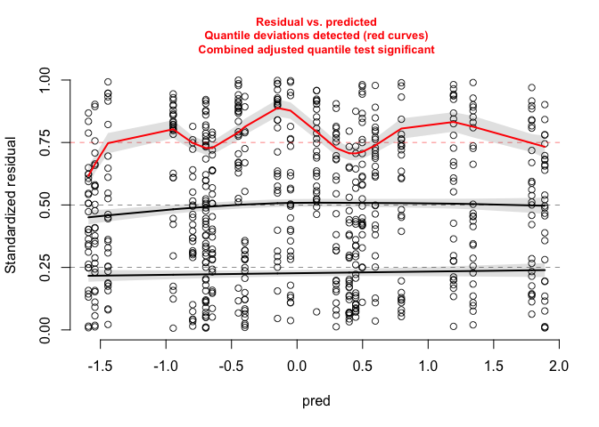<!-- -->

```r
plotResiduals(res, Salamanders$Wtemp)
```

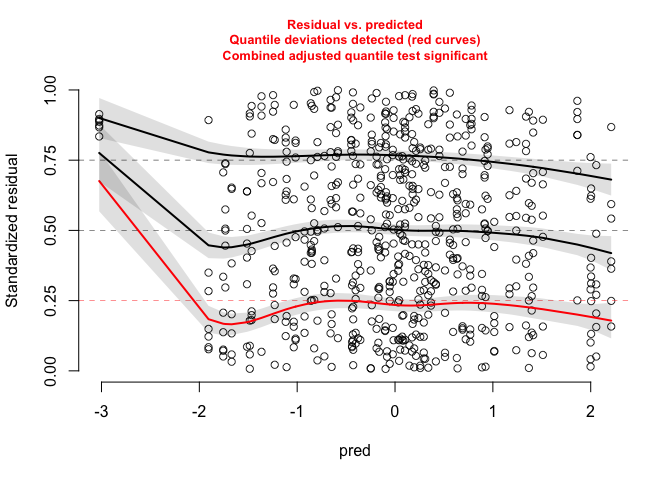<!-- -->


# Other options


## Marginal vs. conditional simulations

Per default, DHARMa re-simulates all fitted REs, i.e. it simulates the entire model structure. You can also calculate simulations conditional on the fitted REs, provided that the regression packages allows that. 

In lme4, conditioning on the REs is done via the re.form argument


```r
set.seed(123)
testData = createData(sampleSize = 200, family = poisson())
fittedModel <- glmer(observedResponse ~ Environment1 + (1|group), 
                     family = "poisson", data = testData)

res <- simulateResiduals(fittedModel = fittedModel)
plot(res)
```

<!-- -->

```r
res <- simulateResiduals(fittedModel = fittedModel, re.form = NULL)
plot(res)
```

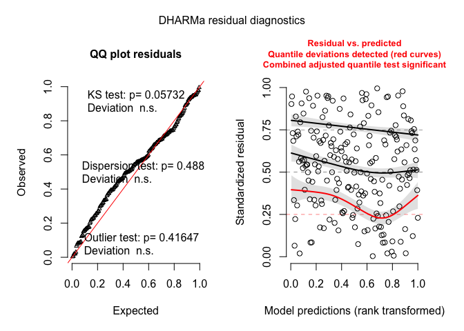<!-- -->

Conditioning on REs has advantages and disadvantages. For some test (in particular dispersion), it seems to me that the power is higher when conditioning on REs. 

## Refit option

Re-fit calculates a parametric bootstrap, i.e. for each simulated dataset, the model is re-fit, and DHARMa calculates quantiles by using the distribution of simulates residuals. 


```r
res <- simulateResiduals(fittedModel = fittedModel, refit = T)
```

```
## Warning in checkConv(attr(opt, "derivs"), opt$par, ctrl =
## control$checkConv, : Model failed to converge with max|grad| = 0.0210763
## (tol = 0.001, component 1)
```

```r
plot(res)
```

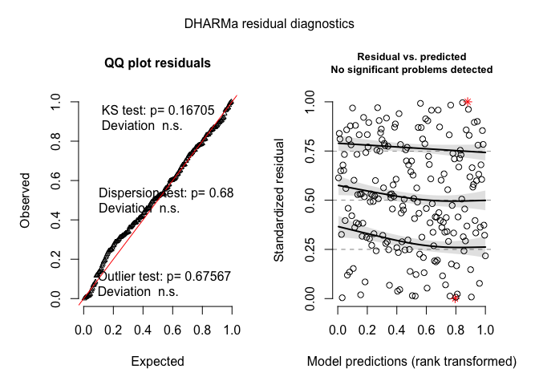<!-- -->


