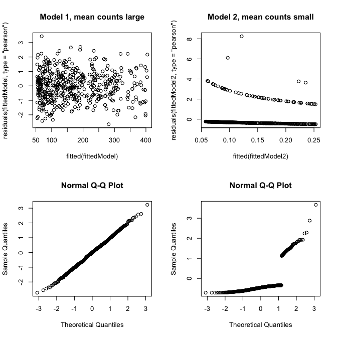
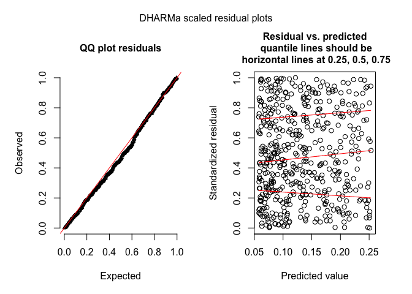

# Deviance residuals
Florian Hartig  
25 Nov 2016  

# Poisson GLM

## Data creation


Creating data for Poisson with large intercept (data1, i.e. nearly normal distribution), and Poisson with small intercept (data 2, strongly skewed)


```r
set.seed(123)
library(DHARMa)

testData = createData(sampleSize = 500, intercept = 5, overdispersion = 0, family = poisson(), randomEffectVariance = 0)
fittedModel <- glm(observedResponse ~ Environment1 , family = "poisson", data = testData)
res = residuals(fittedModel, type = "deviance")

testData2 = createData(sampleSize = 500, intercept = -2, overdispersion = 0, family = poisson(), randomEffectVariance = 0)
fittedModel2 <- glm(observedResponse ~ Environment1 , family = "poisson", data = testData2)
res2 = residuals(fittedModel2, type = "deviance")
```


## Visual comparison via residual plots and normal qq Plots


```r
par(mfrow = c(2,2))
plot(fitted(fittedModel), res2, main = "Model 1, mean counts large")
plot(fitted(fittedModel2), res2, main = "Model 2, mean counts small")
qqnorm(res )
qqnorm(res2)
```

<!-- -->

For large counts, QQ is approximately normally distribtion, which is expected as the Poisson approaches normality for large means. For small counts, there is a notable deviation from normality. 


## Test for normality


```r
shapiro.test(res)
```

```
## 
## 	Shapiro-Wilk normality test
## 
## data:  res
## W = 0.99866, p-value = 0.9718
```

```r
shapiro.test(res2)
```

```
## 
## 	Shapiro-Wilk normality test
## 
## data:  res2
## W = 0.54557, p-value < 2.2e-16
```


## DHARMa residuals


DHARMa corrects this problem (showing here only model 2 because 1 is no problem anyway)


```r
resDHARMa = simulateResiduals(fittedModel2)
plot(resDHARMa)
```

<!-- -->

