# Overdispersion tests
Florian Hartig  
`r Sys.Date()`  


```r
dispValues = seq(0,1.2, len = 7)
replicates = 50
```

# Poisson test

## General idea / options

### No overdispersion


```r
testData = createData(sampleSize = 200, overdispersion = 0, family = poisson())

fittedModel <- glmer(observedResponse ~ Environment1 + (1|group) , family = "poisson", data = testData)

sim = simulateResiduals(fittedModel)
plot(sim)
```

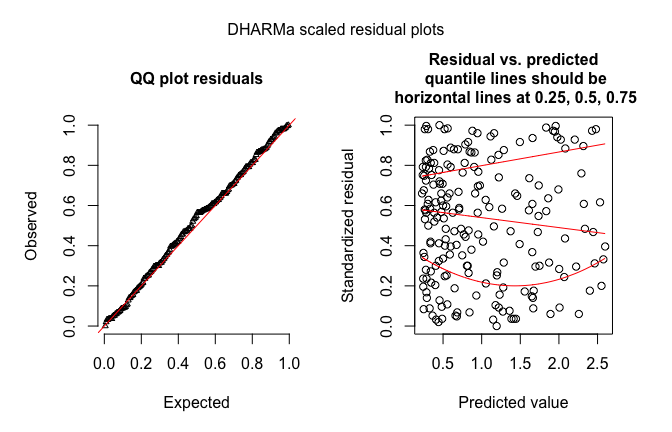

```r
# Parametric test
testOverdispersionParametric(fittedModel)
```

```
## 
## 	Chisq test for overdispersion in GLMMs
## 
## data:  poisson
## dispersion = 0.85759, pearSS = 168.95000, rdf = 197.00000, p-value
## = 0.9268
## alternative hypothesis: true dispersion greater 1
```

```r
# Omnibus test
testOverdispersionParametric(fittedModel)
```

```
## 
## 	Chisq test for overdispersion in GLMMs
## 
## data:  poisson
## dispersion = 0.85759, pearSS = 168.95000, rdf = 197.00000, p-value
## = 0.9268
## alternative hypothesis: true dispersion greater 1
```

```r
# Non-parametric test

sim = simulateResiduals(fittedModel,refit = T)
plot(sim)
```

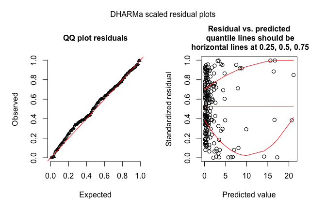

```r
testOverdispersion(sim,  plot = T)
```

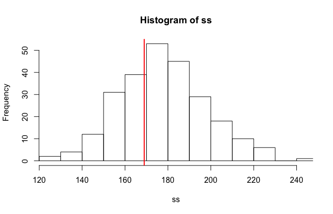

```
## 
## 	DHARMa nonparametric overdispersion test via comparison to
## 	simulation under H0 = fitted model
## 
## data:  sim
## dispersion = 0.94948, p-value = 0.672
## alternative hypothesis: overdispersion
```

### Overdispersion


```r
testData = createData(sampleSize = 200, overdispersion = 1, family = poisson())

fittedModel <- glmer(observedResponse ~ Environment1 + (1|group) , family = "poisson", data = testData)

sim = simulateResiduals(fittedModel)
plot(sim)
```

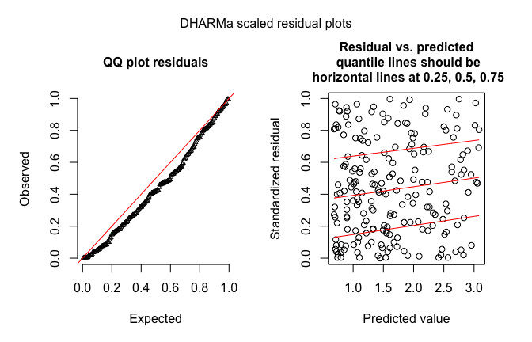

```r
# Parametric test
testOverdispersionParametric(fittedModel)
```

```
## 
## 	Chisq test for overdispersion in GLMMs
## 
## data:  poisson
## dispersion = 5.3685, pearSS = 1057.6000, rdf = 197.0000, p-value <
## 2.2e-16
## alternative hypothesis: true dispersion greater 1
```

```r
# Omnibus test
testOverdispersionParametric(fittedModel)
```

```
## 
## 	Chisq test for overdispersion in GLMMs
## 
## data:  poisson
## dispersion = 5.3685, pearSS = 1057.6000, rdf = 197.0000, p-value <
## 2.2e-16
## alternative hypothesis: true dispersion greater 1
```

```r
# Non-parametric test

sim = simulateResiduals(fittedModel,refit = T)
plot(sim)
```

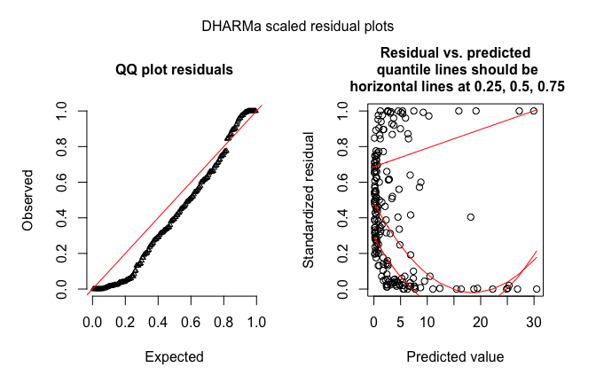

```r
testOverdispersion(sim,  plot = T)
```

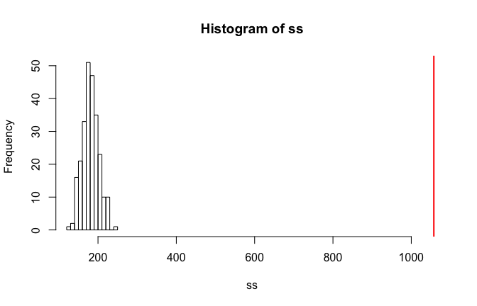

```
## 
## 	DHARMa nonparametric overdispersion test via comparison to
## 	simulation under H0 = fitted model
## 
## data:  sim
## dispersion = 5.8548, p-value < 2.2e-16
## alternative hypothesis: overdispersion
```

### Overdispersion corrected


```r
testData = createData(sampleSize = 200, overdispersion = 1, family = poisson())

fittedModel <- glmer(observedResponse ~ Environment1 + (1|group) + (1|ID) , family = "poisson", data = testData)

sim = simulateResiduals(fittedModel)
plot(sim)
```

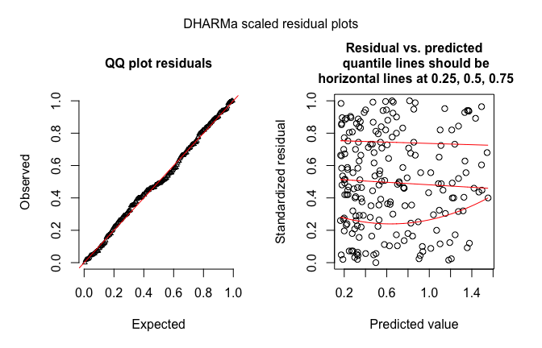

```r
# Parametric test
testOverdispersionParametric(fittedModel)
```

```
## 
## 	Chisq test for overdispersion in GLMMs
## 
## data:  poisson
## dispersion = 0.36637, pearSS = 71.80800, rdf = 196.00000, p-value
## = 1
## alternative hypothesis: true dispersion greater 1
```

```r
# Omnibus test
testOverdispersionParametric(fittedModel)
```

```
## 
## 	Chisq test for overdispersion in GLMMs
## 
## data:  poisson
## dispersion = 0.36637, pearSS = 71.80800, rdf = 196.00000, p-value
## = 1
## alternative hypothesis: true dispersion greater 1
```

```r
# Non-parametric test

sim = simulateResiduals(fittedModel,refit = T)
plot(sim)
```

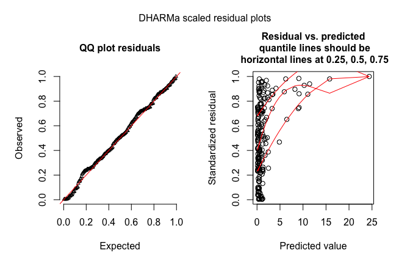

```r
testOverdispersion(sim,  plot = T)
```

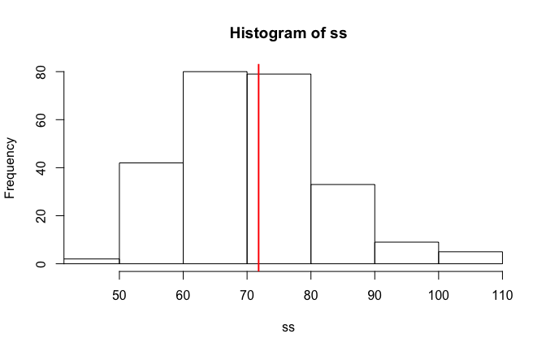

```
## 
## 	DHARMa nonparametric overdispersion test via comparison to
## 	simulation under H0 = fitted model
## 
## data:  sim
## dispersion = 1.0163, p-value = 0.456
## alternative hypothesis: overdispersion
```


## Power analysis

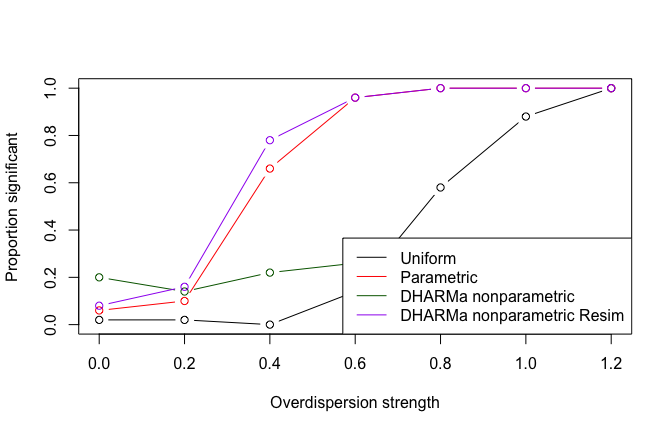


# Binomial k/n test


## 1/0 case

Just to show that overdispersion does not show up in 1/0 data


```r
testData = createData(sampleSize = 200, overdispersion = 1, family = binomial())

fittedModel <- glmer(observedResponse ~ Environment1 + (1|group) , family = "binomial", data = testData)

sim = simulateResiduals(fittedModel)
plot(sim)
```

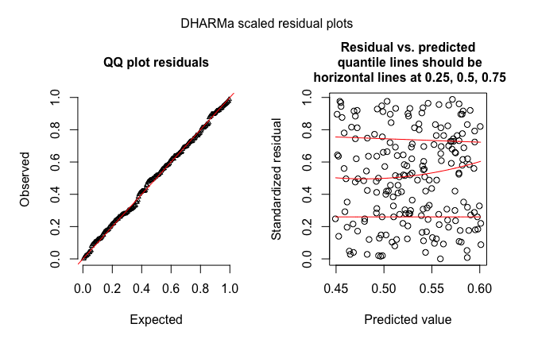

```r
# Parametric test
testOverdispersionParametric(fittedModel)
```

```
## 
## 	Chisq test for overdispersion in GLMMs
## 
## data:  binomial
## dispersion = 0.87278, pearSS = 171.94000, rdf = 197.00000, p-value
## = 0.9009
## alternative hypothesis: true dispersion greater 1
```

```r
# Omnibus test
testOverdispersionParametric(fittedModel)
```

```
## 
## 	Chisq test for overdispersion in GLMMs
## 
## data:  binomial
## dispersion = 0.87278, pearSS = 171.94000, rdf = 197.00000, p-value
## = 0.9009
## alternative hypothesis: true dispersion greater 1
```

```r
# Non-parametric test

sim = simulateResiduals(fittedModel,refit = T)
plot(sim)
```

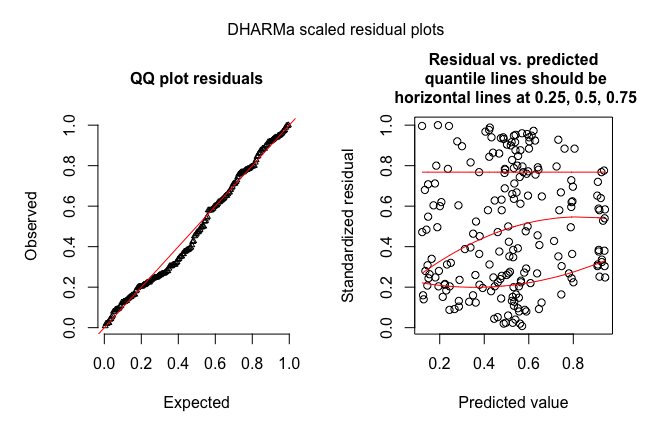

```r
testOverdispersion(sim,  plot = T)
```

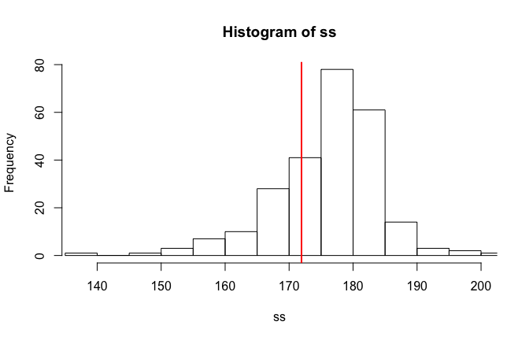

```
## 
## 	DHARMa nonparametric overdispersion test via comparison to
## 	simulation under H0 = fitted model
## 
## data:  sim
## dispersion = 0.97606, p-value = 0.752
## alternative hypothesis: overdispersion
```


## n/k case

### No overdispersion


```r
testData = createData(sampleSize = 200, overdispersion = 0, family = binomial(), binomialTrials = 20)

fittedModel <- glmer(cbind(observedResponse1,observedResponse0) ~ Environment1 + (1|group) , family = "binomial", data = testData)

sim = simulateResiduals(fittedModel)
plot(sim)
```

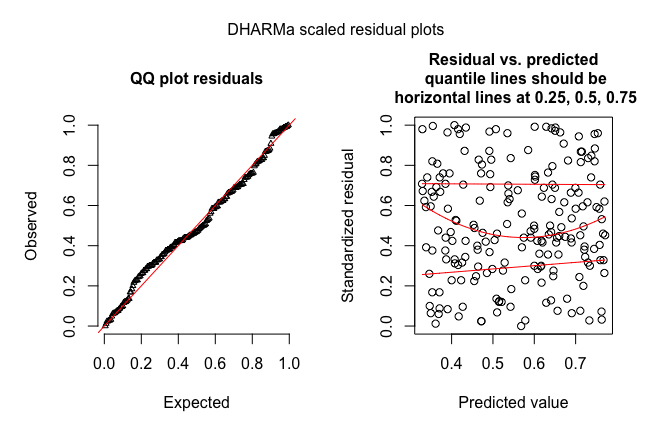

```r
# Parametric test
testOverdispersionParametric(fittedModel)
```

```
## 
## 	Chisq test for overdispersion in GLMMs
## 
## data:  binomial
## dispersion = 0.85376, pearSS = 168.19000, rdf = 197.00000, p-value
## = 0.9325
## alternative hypothesis: true dispersion greater 1
```

```r
# Omnibus test
testOverdispersionParametric(fittedModel)
```

```
## 
## 	Chisq test for overdispersion in GLMMs
## 
## data:  binomial
## dispersion = 0.85376, pearSS = 168.19000, rdf = 197.00000, p-value
## = 0.9325
## alternative hypothesis: true dispersion greater 1
```

```r
# Non-parametric test

sim = simulateResiduals(fittedModel,refit = T)
plot(sim)
```

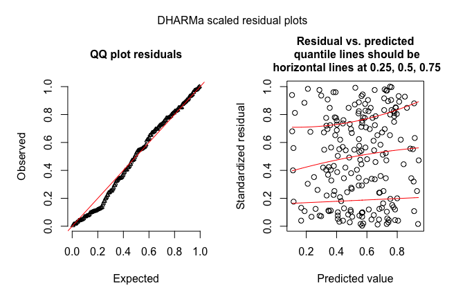

```r
testOverdispersion(sim,  plot = T)
```

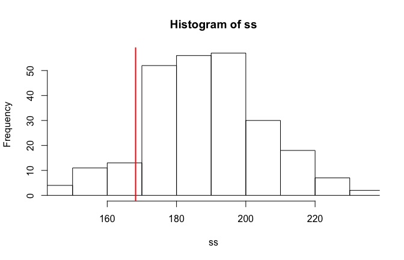

```
## 
## 	DHARMa nonparametric overdispersion test via comparison to
## 	simulation under H0 = fitted model
## 
## data:  sim
## dispersion = 0.89365, p-value = 0.896
## alternative hypothesis: overdispersion
```

### Overdispersion


```r
testData = createData(sampleSize = 200, overdispersion = 1, family = binomial(), binomialTrials = 20)

fittedModel <- glmer(cbind(observedResponse1,observedResponse0) ~ Environment1 + (1|group) , family = "binomial", data = testData)

sim = simulateResiduals(fittedModel)
plot(sim)
```

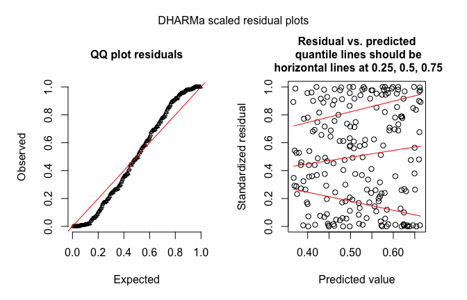

```r
# Parametric test
testOverdispersionParametric(fittedModel)
```

```
## 
## 	Chisq test for overdispersion in GLMMs
## 
## data:  binomial
## dispersion = 3.8277, pearSS = 754.0500, rdf = 197.0000, p-value <
## 2.2e-16
## alternative hypothesis: true dispersion greater 1
```

```r
# Omnibus test
testOverdispersionParametric(fittedModel)
```

```
## 
## 	Chisq test for overdispersion in GLMMs
## 
## data:  binomial
## dispersion = 3.8277, pearSS = 754.0500, rdf = 197.0000, p-value <
## 2.2e-16
## alternative hypothesis: true dispersion greater 1
```

```r
# Non-parametric test

sim = simulateResiduals(fittedModel,refit = T)
plot(sim)
```

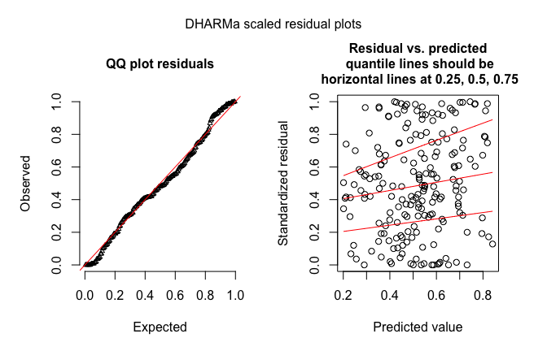

```r
testOverdispersion(sim,  plot = T)
```

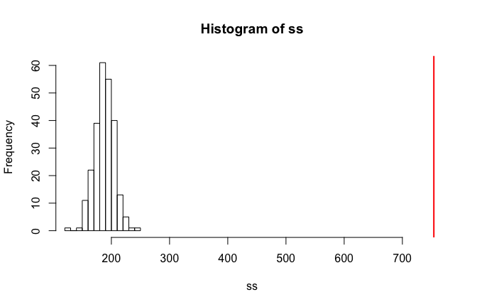

```
## 
## 	DHARMa nonparametric overdispersion test via comparison to
## 	simulation under H0 = fitted model
## 
## data:  sim
## dispersion = 4.0024, p-value < 2.2e-16
## alternative hypothesis: overdispersion
```

### Overdispersion corrected


```r
testData = createData(sampleSize = 200, overdispersion = 0.2, family = binomial(), binomialTrials = 20)

fittedModel <- glmer(cbind(observedResponse1,observedResponse0) ~ Environment1 + (1|group) + (1|ID) , family = "binomial", data = testData)

sim = simulateResiduals(fittedModel)
plot(sim)
```

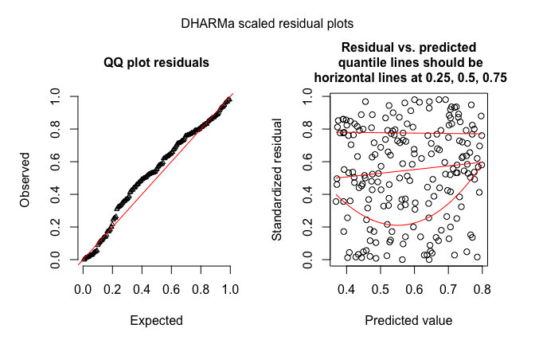

```r
# Parametric test
testOverdispersionParametric(fittedModel)
```

```
## 
## 	Chisq test for overdispersion in GLMMs
## 
## data:  binomial
## dispersion = 0.84194, pearSS = 165.02000, rdf = 196.00000, p-value
## = 0.9476
## alternative hypothesis: true dispersion greater 1
```

```r
# Omnibus test
testOverdispersionParametric(fittedModel)
```

```
## 
## 	Chisq test for overdispersion in GLMMs
## 
## data:  binomial
## dispersion = 0.84194, pearSS = 165.02000, rdf = 196.00000, p-value
## = 0.9476
## alternative hypothesis: true dispersion greater 1
```

```r
# Non-parametric test

sim = simulateResiduals(fittedModel,refit = T)
plot(sim)
```

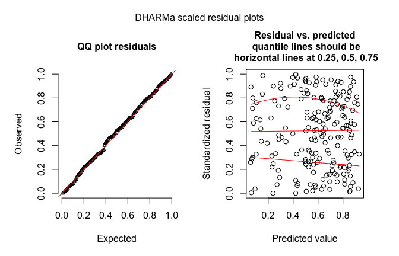

```r
testOverdispersion(sim,  plot = T)
```

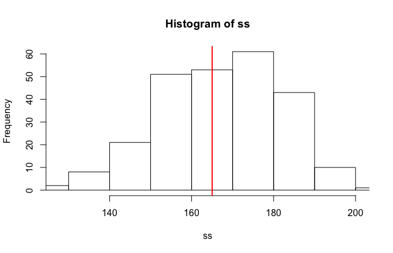

```
## 
## 	DHARMa nonparametric overdispersion test via comparison to
## 	simulation under H0 = fitted model
## 
## data:  sim
## dispersion = 0.98693, p-value = 0.564
## alternative hypothesis: overdispersion
```


## Power analysis

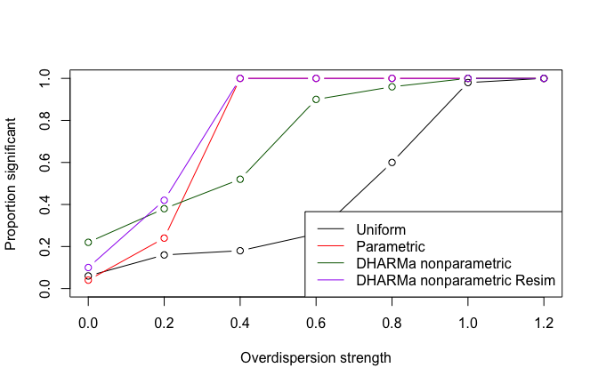


