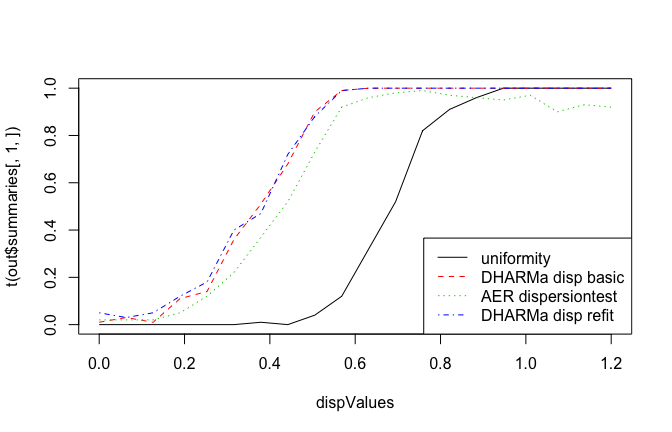

```{r, echo = F}
library(DHARMa)
set.seed(123)
```


```{r global_options, include=FALSE}
knitr::opts_chunk$set(fig.width=7, fig.height=4.5, warning=FALSE, message=FALSE, cache = T)
```

# Motivation 

Residual interpretation for generalized linear mixed models is often problematic. As an example, here two Poisson GLMMs, one that is lacking a quadratic effect, and one that fits the data perfectly. I show three standard residuals diagnostics each. Can you say which is the misspecified model?

```{r, echo = F, fig.width=8, fig.height=3.5}
library(lme4)

overdispersedData = createData(sampleSize = 250, overdispersion = 0, quadraticFixedEffects = -2, family = poisson())
fittedModelOverdispersed <- glmer(observedResponse ~ Environment1 + (1|group) , family = "poisson", data = overdispersedData)

plotConventionalResiduals(fittedModelOverdispersed)


testData = createData(sampleSize = 250, intercept = 0, overdispersion = 0, family = poisson(), randomEffectVariance = 0)
fittedModel <- glmer(observedResponse ~ Environment1 + (1|group) , family = "poisson", data = testData)

plotConventionalResiduals(fittedModel)

```

Just for completeness - it was the first one. Don't get too excited if you got it right, though. Either you were lucky, or you noted that the first model seems a bit overdispersed. But even if you noted the latter, would you have added a quadratic effect, instead of adding an overdispersion correction? The point that I want to make is that misspecifications in GL(M)Ms cannot reliably be diagnosed with standard residual plots, and GLMMs are not often as thoroghly checked as LMs. 

The reason why GL(M)Ms residuals are harder to interpret is that the expected distribution of the data changes with the fitted values in all kind of ways. Reweighting with the expected variance, as done in Pearson residuals, or using deviance residuals, helps a bit, but does not lead to visually homogenous residuals when the model is correctly specified. As a result, standard residual plots, when interpreted in the same way as for linear models, seem to show all kind problems such as non-normality, heteroskedasticity and so on, even if the model is correctly specified. Questions on the R mailing lists and forums show that practitioners are regularly confuses about the question if pearson or deviance residuals for GL(M)Ms show a problem or not. 

But even experienced statistical analysists currently have few options to diagnose specification problems in GLMMs. In my experience, the current best practice is to eyeball residual plots for major misspecifications, potentially have a look at the random effect distribution, and the run a test for overdispersion, which is usually positive, after which the model is modified towards an overdispersed / zero-inflated distribution. This approach, however, has a number of problems. Just a few examples:

* Overdispersion often comes from missing or misspecified predictors. Standard residual plots make it difficult to test for relationships between predictors 

* Not all overdispersion is the same. For count data, the negative binomial creates a different distribution than individual-level random effects in the Poisson. Differences between distributional assumptions are difficult to see with overdispersion tests

* Dispersion frequenly varies with predictors (heteroskedasticity). This is often the case in count data, but currently hardly ever tested.  

DHARMa aims at solvind this problem by creating readily interpretable residuals for generalized linear (mixed) models that are standardized to values between 0 and 1, and that can be interpreted as intuitively as residuals for the linear model. This is achieved by a simulation-based approach, similar to the Bayesian p-value or the parametric bootstrap: 

1. simulate new data from the fitted model

2. from this simulated data, calculate the empirical cummulative density function  

3. residual is the value of the empirical density function at the value of the observed data. 

The key idea for this definition is that, if the model is correctly specified, then the observed data can be thought of as a draw from the fitted model. Hence, for a correctly specified model, all values of the cummulative distribution will appear with equal probability. What that means is that we expect the distribution of the residuals definen in 3) to be flat, regardless what the exact model structure is (Poisson, binomial, ...).

A more exact statistical justification for the appoach will be provided in an accompanying paper, but if you must provide a reference I would suggest citing 

* Dunn, K. P., and Smyth, G. K. (1996). Randomized quantile residuals. Journal of Computational and Graphical Statistics 5, 1-10. 

* Gelman, A. & Hill, J. Data analysis using regression and multilevel/hierarchical models Cambridge University Press, 2006

# Workflow in DHARMa

## Installing, loading and citing the package

If you haven't installed the package yet, either run

```{r, eval = F}
install.packages("DHARMa")
```

Or follow the instructions on [https://github.com/florianhartig/DHARMa](https://github.com/florianhartig/DHARMa) to install a development version. Usually, snapshots of the latest development version will be available at

```{r, eval = F}
library(devtools)
install_url("https://dl.dropboxusercontent.com/s/xlvjf0vpslukl29/DHARMa.tar.gz", dependencies = T)
```

Loading and citation

```{r}
library(DHARMa)
citation("DHARMa")
```

## Calculating scaled residuals 

The scaled (quantile) residuals are calculated with the simulateResiduals() functions. The default number of simulations to run is 250, but for very stable results you may want to increase this number. 

```{r}
simulationOutput <- simulateResiduals(fittedModel = fittedModel, n = 250)
```

The function creates 250 new datasets by simulating from the fitted model, calcualtes the cummulative distribution of simulated values for each observed value, and returns the quantile value that corresponds to the observed value. 

For example, a simulated residual of 0.5 means that half of the simulated data are higher, and half of them lower than the observed value. A value of 0.99 would mean that nearly all simulated data are lower than the observed value. The minium/maxium values for the residuals are 0 and 1. 

The calculated residuals are stored in 

```{r, eval = F}
simulationOutput$scaledResiduals
```

As discussed above, for a correctly specified model we would expect 

* a uniform (flat) distribution of the overall residuals 

* uniformity in y direction if we plot against any predictor. 

## Plotting the scaled residuals

We can get a visual impression of these properties with the plotSimulatedResiduals() function

```{r}
plotSimulatedResiduals(simulationOutput = simulationOutput)
```

which creates a qq-plot to detect overall deviations from normality, and a plot of the residuals against the predicted value. 

To provide a visual aid in detecting deviations from uniformity in y-direction, the plot of the residuals against the predited values also performs an (optional) quantile regression, which provides 0.25, 0.5 and 0.75 quantile lines across the plots. These lines should be straight, horizontal, and at y-values of 0.25, 0.5 and 0.75. 

If you want to plot the residuals against other predictors (highly recommend), you can use the function

```{r, eval = F}
plotResiduals(YOURPREDICTOR, simulationOutput$scaledResiduals)
```

which does the same quantile plot as the main plotting function. 

## Formal goodness-of-fit tests on the scaled residuals

To support the visual inspection, the DHARMa package provides a numer of specialized goodness-of-fit tests on the simulated residuals. For example, the function 

```{r}
testUniformity(simulationOutput = simulationOutput)
```

runs a KS test to test for overall uniformity of the residuals.

* testOverdispersion()
* testZeroinflation()
* testTemporalAutocorrelation()
* testSpatialAutocorrelation()

See the help of the functions for a more detailed description of what they do

## Simulation options

There are a few important technical details regarding how the simulations are performed, in particular regarding the treatments of random effects and integer responses. I would therefore strongly recommend to read the help 

```{r, eval = F}
?simulateResiduals
```

The short summary is this: apart from the number of simulations, there are two important options in the simulateResiduals function

#### Refit

```{r, eval= F}
simulationOutput <- simulateResiduals(fittedModel = fittedModel, refit = T)
```

* if refit = F (default), new data is simulated from the fitted model, and residuals are calculated by comparing the observed data to the new data

* if refit = T, a parametric bootstrap is performed, meaning that the model is refit on the new data, and residuals are created by comparing observed residuals against refitted residuals 

The second option is much slower, and only important for running tests that rely on comparing observed to simulated residuals, e.g. the testOverdispersion function (see below) 

#### Random effect simulations

The second option is the treatment of the stochastic hierarchy. In a hierarchical model, several layers of stochasticity are aligned on top of each other. Specifically, in a GLMM, we have a lower level stochastic process (random effect), whose result enters into a higher level (e.g. Poisson distribution). For other hierarchical models such as state-space models, similar considerations apply. When simulating, we have to decide if we want to re-simulate all stochastic levels, or only a subset of those. For example, in a GLMM, it is common to only simulate the last stochastic level (e.g. Poisson) conditional on the fitted random effects.

For controlling how many levels should be re-simulated, the simulateResidual function allows to pass on parameters to the simulate function of the fitted model object. Please refer to the help of the different simulate functions (e.g. ?simulate.merMod) for details. For merMod (lme4) model objects, the relevant parameters are parameters are use.u, and re.form, as, e.g., in 


```{r, eval= F}
simulationOutput <- simulateResiduals(fittedModel = fittedModel, n = 250, use.u = T)
```

If the model is correctly specified, the simulated residuals should be flat regardles how many hierarchical levels we re-simulate. The most thorough procedure would therefore be to test all possible options. If testing only one option, I would recommend to re-simulate all levels, because this esentially tests the model structure as a whole. This is the default setting in the DHARMa package. A potential drawback is that re-simulating the lower-level random effects creates more variability, which may reduce power for detecing problems in the upper-level stochatic processes.


#### Integer treatment

A third option is the treatment of integer responses. This is handled automatically by simulateResiduals function and should usually not be changed. See the help for details

# Visual diagnostics and tests of common misspecification problems 

So far, all the plots / tests were run for a correctly specified model. In this section, we discuss how model misspecification will show up in the scaled residuals.

## Overdispersion / underdispersion

The most common concern for GLMMs is overdispersion, underdispersion and zero-inflation.

Over/underdispersion refers to the phenomenon that that residual variance is larger/smaller than expected under the fitted model. Over/underdispersion can appear for any distributional family with fixed variance, in particular for Poisson and binomial models. 

A few general rules of thumb

* You can detect overdispersion / zero-inflation only AFTER fitting the model
* Overdispersion is more common than underdispersion
* If overdispersion is present, confidence intervals tend to be too narrow, and p-values to small. The opposite is true for underdispersion
* A common reason for overdispersion is a misspecified models. When overdispersion is detected, one should therefore firest search for problems in the model specification (e.g. by plotting residuals against predictors), and only if this doesn't lead to success, overdispersion corrections such as individual-level random effects or changes in the distribution should be applied

#### An example of overdispersion

This this is how **overdispersion** looks like in the DHARMa residuals

```{r}
testData = createData(sampleSize = 500, overdispersion = 2, family = poisson())
fittedModel <- glmer(observedResponse ~ Environment1 + (1|group) , family = "poisson", data = testData)

simulationOutput <- simulateResiduals(fittedModel = fittedModel)
plotSimulatedResiduals(simulationOutput = simulationOutput)
```

Note that we get more residuals around 0 and 1, which means that residuals are in the tail of distribution that would be expected under the fitted model. 

#### An example of underdispersion

And this is underdispersion 

```{r}
testData = createData(sampleSize = 500, intercept=0, fixedEffects = 2, overdispersion = 0, family = poisson(), roundPoissonVariance = 0.001, randomEffectVariance = 0)
fittedModel <- glmer(observedResponse ~ Environment1 + (1|group) , family = "poisson", data = testData)

summary(fittedModel)

# plotConventionalResiduals(fittedModel)

simulationOutput <- simulateResiduals(fittedModel = fittedModel)
plotSimulatedResiduals(simulationOutput = simulationOutput)
testUniformity(simulationOutput = simulationOutput)
```

Here, we get too many residuals around 0.5, which means that we are not getting as many residuals as we would expect in the tail of the distribution that is epected with the fitted model. 

which shows the expected distribution of the number of zeros against the observed number of zeros. 


#### Testing for over/underdispersion

Although overdispersion should show up in the above test, simulations show that this test is considerably less powerfull than more targeted tests. 

```{r overDispersionTest, echo = F}
simulationOutput2 <- simulateResiduals(fittedModel = fittedModel, n = 250, refit = T)
testOverdispersion(simulationOutput2)
```

Simulations show that this diagnostic has similar power than the parametric overdispersion tests

```{r}
testOverdispersionParametric(fittedModel)
```




## Zero-inflation

A common special case of overdispersion is zero-inflation, which is the situation when more zeros appear in the observation than expected under the fitted model. Zero-inflation requires special correction steps. 


#### An example of zero-inflation

For pedagogical reasons, I plot this data against the environmental predictor

```{r}
testData = createData(sampleSize = 500, intercept = 2, fixedEffects = c(1), overdispersion = 0, family = poisson(), quadraticFixedEffects = c(-3), randomEffectVariance = 0, pZeroInflation = 0.6)

par(mfrow = c(1,2))
plot(testData$Environment1, testData$observedResponse, xlab = "Envrionmental Predictor", ylab = "Response")
hist(testData$observedResponse, xlab = "Response", main = "")
```

We see a hump-shaped dependence of the environment, but with too many zeros. 

#### Zero-inflation in the scaled residuals

In the normal residual, plots, zero-inflation will look pretty much like overdispersion

```{r}

fittedModel <- glmer(observedResponse ~ Environment1 + I(Environment1^2) + (1|group) , family = "poisson", data = testData)

simulationOutput <- simulateResiduals(fittedModel = fittedModel)
plotSimulatedResiduals(simulationOutput = simulationOutput)
```

The reason is that the model will usually try to find a compromise between the zeros, and the other values, which will lead to excecss variation in the resiudals. 

#### Test for zero-inflation

DHARMa has a special test for zero-inflation, which compares the distribution of expected zeros in the data against the observed zeros

```{r, fig.width=4, fig.height=4.5}

testZeroInflation(simulationOutput)
```

It is likely better to detect zero-inflation, but note that also overdispersion will lead to excess zeros. A reliable differentiation between overdispersion and zero-inflation will only be possible when directly comparing it, e.g. through comparing parameter estimates of a model that inlcudes both options, or throught model selection. 


## Heteroscedasticity

So far, most of the things that we have tested could also have been detected with paramtric tests. Here, we come to the first issue that is difficult to detect with current tests, and that is usually neglected. 

Heteroscedasticity means that there is a systematic dependency of the dispersion / variance on another variable in the model. It is not sufficiently appreciated that also binomial or poisson models can show heteroscedasticity. Basically, it means that the level of over/underdispersion depends on another parameter. Here an example where we create such data 

```{r}
testData = createData(sampleSize = 500, intercept = 0, overdispersion = function(x){return(rnorm(length(x), sd = 2*abs(x)))}, family = poisson(), randomEffectVariance = 0)
fittedModel <- glmer(observedResponse ~ Environment1 + (1|group), family = "poisson", data = testData)

simulationOutput <- simulateResiduals(fittedModel = fittedModel)
plotSimulatedResiduals(simulationOutput = simulationOutput)
testUniformity(simulationOutput = simulationOutput)
```

Adding a simple overdispersion correction will try to find a compromise between the different levels of dispersion in the model. The qq plot looks better now, but there is still a pattern in the residuals 

```{r}
testData = createData(sampleSize = 500, intercept = 0, overdispersion = function(x){return(rnorm(length(x), sd = 2*abs(x)))}, family = poisson(), randomEffectVariance = 0)
fittedModel <- glmer(observedResponse ~ Environment1 + (1|group) + (1|ID), family = "poisson", data = testData)

# plotConventionalResiduals(fittedModel)

simulationOutput <- simulateResiduals(fittedModel = fittedModel)
plotSimulatedResiduals(simulationOutput = simulationOutput)
testUniformity(simulationOutput = simulationOutput)
```

To remove this patter, you would need to make the dispersion parameter dependent on a predictor (e.g. in JAGS), or apply a transformation. 

## Missing predictors or quadratic effects 

A second test that is typically run for LMs, but not for GL(M)Ms is to plot residuals against the predictors in the model (or potentially predictors that were not in the model) to detect possible misspecifcations. Doing this is *highly recommeded*. For that purpose, you can retrieve the residuals via 

```{r, eval = F}
simulationOutput$scaledResiduals
```

Note again that the residual values are scaled between 0 and 1. If you plot the residuals against predictors, space or time, the resulting plots should not only show no systematic dependency of those residuals on the covariates, but they should also again be flat for each fixed situation. That means that if you have, for example, a categorical predictor: treatment / control, the distribution of residuals for each predictor alone should be flat as well. 

Here an example with a missing quadratic effect in the model and 2 predictors

```{r}
testData = createData(sampleSize = 200, intercept = 1, fixedEffects = c(1,2), overdispersion = 0, family = poisson(), quadraticFixedEffects = c(-3,0))
fittedModel <- glmer(observedResponse ~ Environment1 + Environment2 + (1|group) , family = "poisson", data = testData)
simulationOutput <- simulateResiduals(fittedModel = fittedModel)
# plotConventionalResiduals(fittedModel)
plotSimulatedResiduals(simulationOutput = simulationOutput, quantreg = T)
testUniformity(simulationOutput = simulationOutput)
```

Difficult to see with the overall pattern, but it becomes clear if we plot against the environment

```{r}
par(mfrow = c(1,2))
plotResiduals(testData$Environment1,  simulationOutput$scaledResiduals)
plotResiduals(testData$Environment2,  simulationOutput$scaledResiduals)
```

## Temporal autocorrelation

A special case of the plotting residuals against predictors is the plot against time and space, which should always be performed if those variables are present in the model. This can be done by hand, but is suppored by the previously introduced tests 

```{r}
testData = createData(sampleSize = 100, family = poisson(), temporalAutocorrelation = 5)

fittedModel <- glmer(observedResponse ~ Environment1 + (1|group), data = testData, family = poisson() )

simulationOutput <- simulateResiduals(fittedModel = fittedModel)
```

#### Test and plot for temporal autocorrelation

The temporal autocorrelation test performs the Durbin-Watson test from the package lmtest on the uniform residuals to test for temporal autocorrelation in the residuals, and additionally plots the residuals against time. An additional test against randomized time (H0) is performed, to show that the test is not oversensitive. 

```{r, fig.width=4, fig.height=4.5}
testTemporalAutocorrelation(simulationOutput = simulationOutput, time = testData$time)
testTemporalAutocorrelation(simulationOutput = simulationOutput, time = "random")
```

Note the caveats mentioned about the dest in the help.

## Spatial autocorrelation

```{r}
testData = createData(sampleSize = 100, family = poisson(), spatialAutocorrelation = 5)

fittedModel <- glmer(observedResponse ~ Environment1 + (1|group), data = testData, family = poisson() )

simulationOutput <- simulateResiduals(fittedModel = fittedModel)

```

#### Test and plot for spatial autocorrelation

The spatial autocorrelation test performs the Moran.I test from the package ape and plots plots the residuals against space. An additional test against randomized space (H0) is performed, to show that the test is not oversensitive. 

```{r, fig.width=4, fig.height=4.5}
testSpatialAutocorrelation(simulationOutput = simulationOutput, x = testData$x, y= testData$y)
testSpatialAutocorrelation(simulationOutput = simulationOutput, x = "random", y= "random")
```

The usual caveats for Moran.I apply, in particular that it may miss non-local and heterogeneous (non-stationary) spatial autocorrelation. The former should be detectable in the spatial plot. 

## Custom tests 

A big advantage of the simulations is that you can test any problem that you think you may have. For example, you think you have an excess of tens in your count data? Maybe a faulty measurement instrument that returns too many tens? Just compare the observed with the expected tens from the simulations.

You think your random effect estimates look weird? Run the model with the refit = T option and see how typical random effect estimates look for your problem.

# Real-world examples

## Budworm (n/k Poisson) example

This example comes from Jochen Fründ. Measured are the number of parasitized adults against the population density

```{r, echo = F}
data = structure(list(N_parasitized = c(226, 689, 481, 960, 1177, 266, 
46, 4, 884, 310, 19, 4, 7, 1, 3, 0, 365, 388, 369, 829, 532, 
5), N_adult = c(1415, 2227, 2854, 3699, 2094, 376, 8, 1, 1379, 
323, 2, 2, 11, 2, 0, 1, 1394, 1392, 1138, 719, 685, 3), density.attack = c(216.461273226486, 
214.662143448767, 251.881252132684, 400.993643475831, 207.897856251888, 
57.0335141562012, 6.1642552100285, 0.503930659141302, 124.673812637575, 
27.3764667492035, 0.923453215863429, 0.399890030241684, 0.829818131526174, 
0.146640466903247, 0.216795117773948, 0.215498663908284, 110.635445098884, 
91.3766566822467, 126.157080458047, 82.9699108890686, 61.0476207779938, 
0.574539291305784), Plot = structure(c(1L, 1L, 1L, 1L, 1L, 1L, 
1L, 1L, 2L, 2L, 2L, 2L, 2L, 2L, 2L, 2L, 3L, 3L, 3L, 3L, 3L, 3L
), .Label = c("1", "2", "3", "4"), class = "factor"), PY = c("p1y82", 
"p1y83", "p1y84", "p1y85", "p1y86", "p1y87", "p1y88", "p1y89", 
"p2y86", "p2y87", "p2y88", "p2y89", "p2y90", "p2y91", "p2y92", 
"p2y93", "p3y88", "p3y89", "p3y90", "p3y91", "p3y92", "p3y93"
), Year = c(82, 83, 84, 85, 86, 87, 88, 89, 86, 87, 88, 89, 90, 
91, 92, 93, 88, 89, 90, 91, 92, 93), ID = 1:22), .Names = c("N_parasitized", 
"N_adult", "density.attack", "Plot", "PY", "Year", "ID"), row.names = c("p1y82", 
"p1y83", "p1y84", "p1y85", "p1y86", "p1y87", "p1y88", "p1y89", 
"p2y86", "p2y87", "p2y88", "p2y89", "p2y90", "p2y91", "p2y92", 
"p2y93", "p3y88", "p3y89", "p3y90", "p3y91", "p3y92", "p3y93"
), class = "data.frame")

data$logDensity = log10(data$density.attack+1)
```


```{r, fig.width=4, fig.height=4.5}
plot(N_parasitized / (N_adult + N_parasitized ) ~ logDensity, xlab = "Density", ylab = "Proportion infected", data = data)
```

Let's fit the data with a regular binomial n/k glm

```{r}
mod1 <- glm(cbind(N_parasitized, N_adult) ~ logDensity, data = data, family=binomial)
simulationOutput <- simulateResiduals(fittedModel = mod1)
plotSimulatedResiduals(simulationOutput = simulationOutput)
```

The residuals look clearly overdispersed. We can confirm that with the omnibus test

```{r}
testUniformity(simulationOutput = simulationOutput)
```

Or with the more powerful oversdispersion test 

```{r}
simulationOutput2 <- simulateResiduals(fittedModel = mod1, refit = T) # remember for this test we need the refit option
testOverdispersion(simulationOutput = simulationOutput2)
```

OK, so let's add overdispersion through an individual-level random effect

```{r}
mod2 <- glmer(cbind(N_parasitized, N_adult) ~ logDensity + (1|ID), data = data, family=binomial)
simulationOutput <- simulateResiduals(fittedModel = mod2)
plotSimulatedResiduals(simulationOutput = simulationOutput)

```

The overdispersion looks better, but you can see that the residuals look a bit irregular. 

Likely, the reason is the steep increase in the beginning that one can see in the raw data plot. One would probably need to apply another transformation or a nonlinear function to completely fit this away.


## Beetlecount / Poisson example 


#### Dataset


```{r, echo=F, cache = T}
altitude = rep(seq(0,1,len = 50), each = 20)
dataID = 1:1000
spatialCoordinate = rep(seq(0,30, len = 50), each = 20)

moisture = runif(1000, -1,1)
deadwood = runif(1000, -1,1)

# random effects + zeroinflation
plot = rep(1:50, each = 20)
year = rep(1:20, times = 50)

yearRandom = rnorm(20, 0, 1)
plotRandom = rnorm(50, 0, 1)
overdispersion = rnorm(1000, sd = 0.5)
zeroinflation = rbinom(1000,1,0.6)

beetles <- rpois(1000, exp( 0  + 12*altitude - 12*altitude^2 - 0.2 * moisture + deadwood 
#  + overdispersion   + plotRandom[plot]
 + yearRandom[year]) * zeroinflation )

data = data.frame(dataID, beetles, altitude, moisture, deadwood, plot, year, spatialCoordinate)
```

This example is a synthetic dataset of measured beetle counts over 50 plots across an altitudinal gradient that are yearly sampled over 20 years. The following plot shows the observed number of beetles (log10) vs. altitude. Additional variables in the data are soil moisture and the amount of deadwood on the plots. 

```{r}
par(mfrow = c(1,3))
plot(log10(beetles) ~ altitude + I(altitude) + moisture, data = data, main = "Beetle counts", xlab = "Altitude")
```

Our question is: what is the effect of altitude on the abundance of the beetle? Let's start with a linear and quadratic term for altitude, linear effect of soil moisture, and random intercepts on plot and year

```{r}
mod <- glmer(beetles ~ altitude + I(altitude^2) + moisture + (1|plot) + (1|year), data = data, family=poisson, control = glmerControl(optCtrl = list(maxfun = 10000)))
simulationOutput <- simulateResiduals(fittedModel = mod)
plotSimulatedResiduals(simulationOutput = simulationOutput)
summary(mod)
```

We see that we have a problem when we plot residuals against deadwood

```{r}
plotResiduals(data$deadwood, simulationOutput$scaledResiduals)
```

so let's add this term as well

```{r}
mod <- glmer(beetles ~ altitude + I(altitude^2) + moisture + deadwood + (1|plot) + (1|year) , data = data, family=poisson, control = glmerControl(optCtrl = list(maxfun = 10000)))
simulationOutput <- simulateResiduals(fittedModel = mod)
plotSimulatedResiduals(simulationOutput = simulationOutput)
summary(mod)
```

still, there is obviously overdispersion in the data, so we'll add an individual level random effect to account for overdispersion

```{r}
mod <- glmer(beetles ~ altitude + I(altitude^2) + moisture + deadwood + (1|plot) + (1|year) + (1|dataID) , data = data, family=poisson, control = glmerControl(optCtrl = list(maxfun = 10000)))
simulationOutput <- simulateResiduals(fittedModel = mod)
plotSimulatedResiduals(simulationOutput = simulationOutput)
```

The data still looks overdispersed. The reason is that there is in fact no standard overdispersion, but zero-inflation in the data. We can look at the excess zeros via

```{r}
testZeroInflation(simulationOutput)
```

which shows that we have too many zeros. We need a GLMM with zero-inflation. The easiest option is to do this in a Bayesian framework, e.g. in JAGS as in [this example](https://github.com/florianhartig/LearningBayes/blob/master/CommentedCode/04-StandardModels/GLMM/Beetles.md)

To be honest however, if I wouldn't it would be hard to tell that zero-inflation is the problem here. The reason is that, if you have zero-inflation, the model will be drawn towards the zeros, which also creates an excess of residuals that are too large. Hence, it is hard to distinguish zero-inflation from the case where we have a case where the individual-level random effect is not successfull at removing the overdispersion, i.e. because the functional form of the added noise is incorrect. The best way to test this is probably to run model selections (e.g. simulated LRTs) between a number of alternative models, e.g. a zero-inflated GLMM vs a number of different overdispersed GLMMs. 


