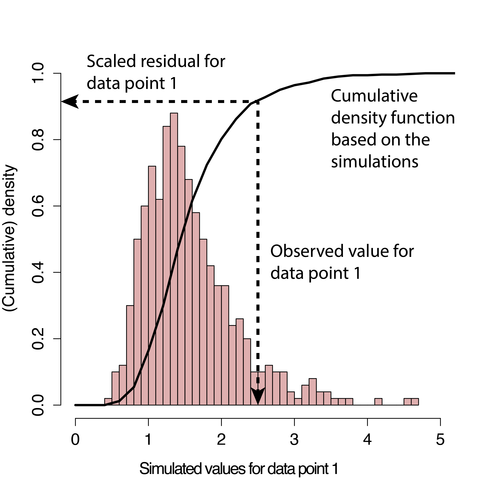
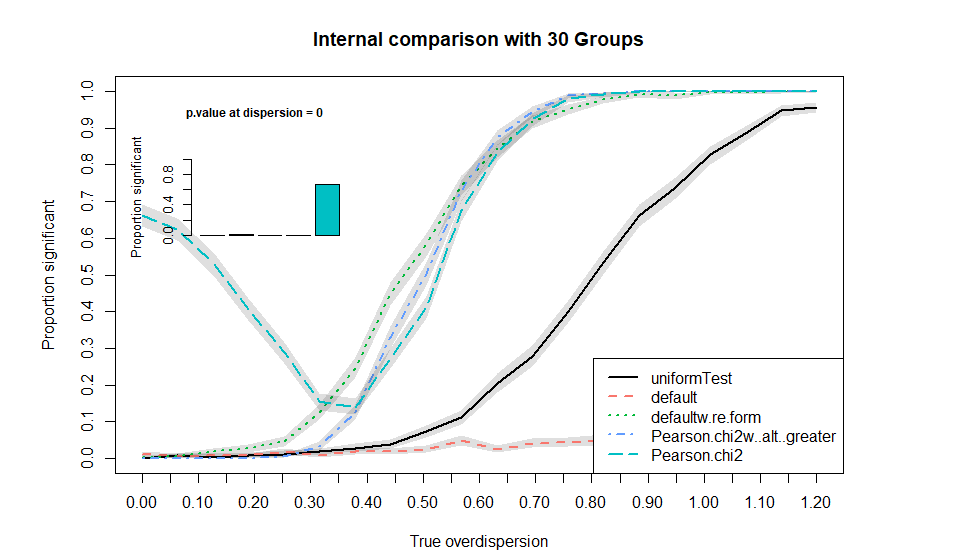

```{r global_options, include=FALSE}
knitr::opts_chunk$set(fig.width=8.5, fig.height=5.5, fig.align='center', warning=FALSE, message=FALSE, cache = T)
```

```{r, echo = F, message = F}
library(DHARMa)
set.seed(123)
```

# Motivation 

The interpretation of conventional residuals for generalized linear (mixed) and other hierarchical statistical models is often problematic. As an example, here the result of conventional Deviance, Pearson and raw residuals for two Poisson GLMMs, one that is lacking a quadratic effect, and one that fits the data perfectly. Could you tell which is the correct model?

```{r, echo = F, fig.width=8, fig.height=3.5}
library(lme4)

overdispersedData = createData(sampleSize = 250, overdispersion = 0, quadraticFixedEffects = -2, family = poisson())
fittedModelOverdispersed <- glmer(observedResponse ~ Environment1 + (1|group) , family = "poisson", data = overdispersedData)

plotConventionalResiduals(fittedModelOverdispersed)

testData = createData(sampleSize = 250, intercept = 0, overdispersion = 0, family = poisson(), randomEffectVariance = 0)
fittedModel <- glmer(observedResponse ~ Environment1 + (1|group) , family = "poisson", data = testData)
plotConventionalResiduals(fittedModel)

```

Just for completeness - it was the first one. But don't get too excited if you got it right. Either you were lucky, or you noted that the first model seems a bit overdispersed (by the range of the Pearson residuals). But even so, would you have added a quadratic effect, instead of adding an overdispersion correction? The point here is that misspecifications in GL(M)Ms cannot reliably be diagnosed with standard residual plots, and thus GLMMs are often not as thoroughly checked as they should. 

One reason why GL(M)Ms residuals are harder to interpret is that the expected distribution of the data (aka predictive distribution) changes with the fitted values. Reweighting with the expected dispersion, as done in Pearson residuals, or using deviance residuals, helps to some extent, but it does not lead to visually homogenous residuals, even if the model is correctly specified. As a result, standard residual plots, when interpreted in the same way as for linear models, seem to show all kind of problems, such as non-normality, heteroscedasticity, even if the model is correctly specified. Questions on the R mailing lists and forums show that practitioners are regularly confused about whether such patterns in GL(M)M residuals are a problem or not. 

But even experienced statistical analysts currently have few options to diagnose misspecification problems in GLMMs. In my experience, the current standard practice is to eyeball the residual plots for major misspecifications, potentially have a look at the random effect distribution, and then run a test for overdispersion, which is usually positive, after which the model is modified towards an overdispersed / zero-inflated distribution. This approach, however, has a number of drawbacks, notably:

* Overdispersion is often the result of missing predictors or a misspecified model structure. Standard residual plots make it difficult to identify these problems by examining residual correlations or patterns of residuals against predictors. 

* Not all overdispersion is the same. For count data, the negative binomial creates a different distribution than adding observation-level random effects to the Poisson. Once overdispersion is corrected for, such violations of distributional assumptions are not detectable with standard overdispersion tests (because the tests only looks at total dispersion), and nearly impossible to see visually from standard residual plots. 

* Dispersion frequently varies with predictors (heteroscedasticity). This can have a significant effect on the inference. While it is standard to tests for heteroscedasticity in linear regressions, heteroscedasticity is currently hardly ever tested for in GLMMs, although it is likely as frequent and influential. 

* Moreover, if residuals are checked, they are usually checked conditional on the fitted random effect estimates. Thus, standard checks only check the final level of the random structure in a GLMM. One can perform extra checks on the random effects, but it is somewhat unsatisfactory that there is no check on the entire model structure. 

DHARMa aims at solving these problems by creating readily interpretable residuals for generalized linear (mixed) models that are standardized to values between 0 and 1, and that can be interpreted as intuitively as residuals for the linear model. This is achieved by a simulation-based approach, similar to the Bayesian p-value or the parametric bootstrap, that transforms the residuals to a standardized scale. The basic steps are:

1. Simulate new response data from the fitted model for each observation.

2. For each observation, calculate the empirical cumulative density function for the simulated observations, which describes the possible values (and their probability) at the predictor combination of the observed value, assuming the fitted model is correct.

3. The residual is then defined as the value of the empirical density function at the value of the observed data, so a residual of 0 means that all simulated values are larger than the observed value, and a residual of 0.5 means half of the simulated values are larger than the observed value. 

These steps are visualized in the following figure 



The key advantage of this definition is that the so-defined residuals always have the same, known distribution, independent of the model that is fit, if the model is correctly specified. To see this, note that, if the observed data was created from the same data-generating process that we simulate from, all values of the cumulative distribution should appear with equal probability. That means we expect the distribution of the residuals to be flat, regardless of the model structure (Poisson, binomial, random effects and so on).

I currently prepare a more exact statistical justification for the approach in an accompanying paper, but if you must provide a reference in the meantime, I would suggest citing 

* Dunn, K. P., and Smyth, G. K. (1996). Randomized quantile residuals. Journal of Computational and Graphical Statistics 5, 1-10. 

* Gelman, A. & Hill, J. Data analysis using regression and multilevel/hierarchical models Cambridge University Press, 2006

p.s.: DHARMa stands for "Diagnostics for HierArchical Regression Models" - which, strictly speaking, would make DHARM. But in German, Darm means intestines; plus, the meaning of DHARMa in Hinduism makes the current abbreviation so much more suitable for a package that tests whether your model is in harmony with your data:

> From Wikipedia, 28/08/16: In Hinduism, dharma signifies behaviours that are considered to be in accord with rta, the order that makes life and universe possible, and includes duties, rights, laws, conduct, virtues and 'right way of living'.

# Workflow in DHARMa

## Installing, loading and citing the package

If you haven't installed the package yet, either run

```{r, eval = F}
install.packages("DHARMa")
```

Or follow the instructions on [https://github.com/florianhartig/DHARMa](https://github.com/florianhartig/DHARMa) to install a development version. 

Loading and citation

```{r}
library(DHARMa)
citation("DHARMa")
```

## Calculating scaled residuals 

Let's assume we have a fitted model that is supported by DHARMa.

```{r}
testData = createData(sampleSize = 250)
fittedModel <- glmer(observedResponse ~ Environment1 + (1|group) , 
                     family = "poisson", data = testData)
```

Most functions in DHARMa can be calculated directly on the fitted model object. For example, if you are only interested in testing for dispersion problems, you could run 

```{r, results = "hide", fig.show='hide'}
testDispersion(fittedModel)
```

In this case, the randomized quantile residuals are calculated on the fly inside the function call. If you work in this way, however, residual calculation will be repeated by every test / plot you call, and this can take a while. It is therefore highly recommended to first calculate the residuals once, using the simulateResiduals() function

```{r}
simulationOutput <- simulateResiduals(fittedModel = fittedModel, plot = F)
```

which calculates calculates randomized quantile residuals according to the algorithm discussed above. The function returns an object of class DHARMa, containing the simulations and the scaled residuals, which can later be passed on to all other plots and test functions. When specifying the optional argument plot = T, the standard DHARMa residual plot is displayed directly. The interpretation of the plot will be discussed below. Using the simulateResiduals function has the added benefit that you can modify the way in which residuals are calculated. For example, you may want to change the number of simulations, or the REs to condition on. See ?simulateResiduals and section "simulation options" below for details. 

The calculated (scaled) residuals can be plotted and tested via a number of DHARMa functions (see below), or accessed directly via

```{r, results = "hide"}
residuals(simulationOutput)
```

To interpret the residuals, remember that a scaled residual value of 0.5 means that half of the simulated data are higher than the observed value, and half of them lower. A value of 0.99 would mean that nearly all simulated data are lower than the observed value. The minimum/maximum values for the residuals are 0 and 1. For a correctly specified model we would expect asymptotically 

* a uniform (flat) distribution of the scaled residuals 

* uniformity in y direction if we plot against any predictor. 

Note: the uniform distribution is the only differences to "conventional" residuals as calculated for a linear regression. If you cannot get used to this, you can transform the uniform distribution to another distribution, for example normal, via

```{r, eval = F}
residuals(simulationOutput, quantileFunction = qnorm, outlierValues = c(-7,7))
```

These normal residuals will behave exactly like the residuals of a linear regression. However, for reasons of a) numeric stability with low number of simulations, which makes it neccessary to descide on which value outliers are to be transformed and b) my conviction that it is much easier to visually detect deviations from uniformity than normality, DHARMa checks all residuals in the uniform space, and I would personally advice against using the transformation. 

## Plotting the scaled residuals

The main plot function for the calculated DHARMa object produced by simulateResiduals() is the plot.DHARMa() function

```{r}
plot(simulationOutput)
```

The function creates two plots, which can also be called separately, and provide extended explanations / examples in the help

```{r, eval = F}
plotQQunif(simulationOutput) # left plot in plot.DHARMa()
plotResiduals(simulationOutput) # right plot in plot.DHARMa()
```

* plotQQunif (left panel) creates a qq-plot to detect overall deviations from the expected distribution, by default with added tests for correct distribution (KS test), dispersion and outliers. Note that outliers in DHARMa are values that are by default defined as values outside the simulation envelope, not in terms of a particular quantile. Thus, which values will appear as outliers will depend on the number of simulations. If you want outliers in terms of a particuar quantile, you can use the outliers() function.    

* plotResiduals (right panel) produces a plot of the residuals against the predicted value (or alternatively, other variable). Simulation outliers (data points that are outside the range of simulated values) are highlighted as red stars. These points should be carefully interpreted, because we actually don't know "how much" these values deviate from the model expectation. Note also that the probability of an outlier depends on the number of simulations, so whether the existence of outliers is a reason for concern depends also on the number of simulations. 

To provide a visual aid in detecting deviations from uniformity in y-direction, the plot function calculates an (optional default) quantile regression, which compares the empirical 0.25, 0.5 and 0.75 quantiles in y direction (red solid lines) with the theoretical 0.25, 0.5 and 0.75 quantiles (dashed black line), and provides a p-value for the deviation from the expected quantile. The significance of the deviation to the expected quantiles is tested and displayed visually, and can be additionally extracted with the testQuantiles function. 

By default, plotResiduals plots against predicted values. However, you can also use it to plot residuals against a specific other predictors (highly recommend).

```{r, eval = F}
plotResiduals(simulationOutput, form = YOURPREDICTOR)
```

If the predictor is a factor, or if there is just a small number of observations on the x axis, plotResiduals will plot a box plot with additional tests instead of a scatter plot.

```{r, eval = F}
plotResiduals(simulationOutput, form = testData$group)
```

See ?plotResiduas for details, but very shortly: under H0 (perfect model), we would expect those boxes to range homogenously from 0.25-0.75. To see whether there are deviations from this expecation, the plot calculates a test for uniformity per box, and a test for homgeneity of variances between boxes. A positive test will be highlighted in red. 

## Goodness-of-fit tests on the scaled residuals

To support the visual inspection of the residuals, the DHARMa package provides a number of specialized goodness-of-fit tests on the simulated residuals:

* testUniformity() - tests if the overall distribution conforms to expectations
* testOutliers() - tests if there are more simulation outliers than expected
* testDispersion() - tests if the simulated dispersion is equal to the observed dispersion
* testQuantiles() - fits a quantile regression or residuals against a predictor (default predicted value), and tests of this conforms to the expected quantile
* testCategorical(simulationOutput, catPred = testData$group) tests residuals against a categorical predictor
* testZeroinflation() - tests if there are more zeros in the data than expected from the simulations
* testGeneric() - test if a generic summary statistics (user-defined) deviates from model expectations
* testTemporalAutocorrelation() - tests for temporal autocorrelation in the residuals
* testSpatialAutocorrelation() - tests for spatial autocorrelation in the residuals. Can also be used with a generic distance function, for example to test for phylogenetic signal in the residuals

See the help of the functions and further comments below for a more detailed description. 


## Simulation options

There are a few important technical details regarding how the simulations are performed, in particular regarding the treatments of random effects and integer responses. It is strongly recommended to read the help of

```{r, eval = F}
?simulateResiduals
```

#### Refit

```{r, eval= F}
simulationOutput <- simulateResiduals(fittedModel = fittedModel, refit = T)
```

* if refit = F (default), new datasets are simulated from the fitted model, and residuals are calculated by comparing the observed data to the new data

* if refit = T, a parametric bootstrap is performed, meaning that the model is refit to all new datasets, and residuals are created by comparing observed residuals against refitted residuals 

The second option is much much slower, and also seemed to have lower power in some tests I ran. ** It is therefore not recommended for standard residual diagnostics!** I only recommend using it if you know what you are doing, and have particular reasons, for example if you estimate that the tested model is biased. A bias could, for example, arise in small data situations, or when estimating models with shrinkage estimators that include a purposeful bias, such as ridge/lasso, random effects or the splines in GAMs. My idea was then that simulated data would not fit to the observations, but that residuals for model fits on simulated data would have the same patterns/bias than model fits on the observed data. 

Note also that refit = T can sometimes run into numerical problems, if the fitted model does not converge on the newly simulated data. 

#### Conditinal vs. unconditinal simulations

The second option is the treatment of the stochastic hierarchy. In a hierarchical model, several layers of stochasticity are placed on top of each other. Specifically, in a GLMM, we have a lower level stochastic process (random effect), whose result enters into a higher level (e.g. Poisson distribution). For other hierarchical models, such as state-space models, similar considerations apply, but the hierarchy can be more complex. When simulating, we have to decide if we want to re-simulate all stochastic levels, or only a subset of those. For example, in a GLMM, it is common to only simulate the last stochastic level (e.g. Poisson) conditional on the fitted random effects, meaning that the random effects are set on the fitted values.

For controlling how many levels should be re-simulated, the simulateResidual function allows to pass on parameters to the simulate function of the fitted model object. Please refer to the help of the different simulate functions (e.g. ?simulate.merMod) for details. For merMod (lme4) model objects, the relevant parameters are "use.u", and "re.form", as, e.g., in 

```{r, eval= F}
simulationOutput <- simulateResiduals(fittedModel = fittedModel, n = 250, use.u = T)
```

If the model is correctly specified and the fitting procedure is unbiased (disclaimer: GLMM estimators are not always unbiased), the simulated residuals should be flat regardless how many hierarchical levels we re-simulate. The most thorough procedure would be therefore to test all possible options. If testing only one option, I would recommend to re-simulate all levels, because this essentially tests the model structure as a whole. This is the default setting in the DHARMa package. A potential drawback is that re-simulating the random effects creates more variability, which may reduce power for detecting problems in the upper-level stochastic processes, in particular overdispersion (see section on dispersion tests below).

*Note:* Although unconditional residuals implicitly also test the normal distribution of the REs, it is probably not a bad idea to look addditionally check for normality of the RE distribution. As this is not based on quantile residuals, there is no special DHARMa function for this, so you should just extract the REs, and then run e.g. a Shapiro test. 

#### Integer treatment / randomization

A third option is the treatment of integer responses. The background of this option is that, for integer-valued variables, some additional steps are necessary to make sure that the residual distribution becomes flat (essentially, we have to smoothen away the integer nature of the data). The idea is explained in 

* Dunn, K. P., and Smyth, G. K. (1996). Randomized quantile residuals. Journal of Computational and Graphical Statistics 5, 1-10. 

DHARMa currently implements two procedures for randomization. The default procedure will randomize automatically. The second option requires knowledge about whether the model is integer-valued, which is usually implemented automatically. See ?simulateResiduals for details. Usually, these options should simply be kept at their defaults.

#### Calculating residuals for groups or subsets

In many situations, it can be useful to look at residuals per group, e.g. to see how much the model over / underpredicts per plot, year or subject. To do this, use the recalculateResiduals() function, together with a grouping variable (group) or a subsetting variable (sel), which can also be used in combination.

```{r, eval= F}
simulationOutput = recalculateResiduals(simulationOutput, group = testData$group)
```

Note, however, that you will have to change the selection of variables that you provide to plots and tests (e.g. in plotResiduals or testSpatialAutocorrelation) accordingly when you group or subset residuals. 

#### Reproducibility notes, random seed and random state

As DHARMa uses simulations to calculate the residuals, a naive implementation of the algorithm would mean that residuals would look slightly different each time a DHARMa calculation is executed. This might both be confusing and bear the danger that a user would run the simulation several times and take the result that looks better (which would amount to multiple testing / p-hacking). 
By default, DHARMa therefore fixes the random seed to the same value every time a simulation is run, and afterwards restores the random state to the old value. This means that you will get exactly the same residual plot each time. If you want to avoid this behavior, for example for simulation experiments on DHARMa, use seed = NULL -> no seed set, but random state will be restored, or seed = F -> no seed set, and random state will not be restored. Whether or not you fix the seed, the setting for the random seed and the random state are stored in 

```{r, eval = F}
simulationOutput$randomState
```

If you want to reproduce simulations for such a run, set the variable .Random.seed by hand, and simulate with seed = NULL. 

Moreover (general advice), to ensure reproducibility, it's advisable to add a set.seed() at the beginning, and a session.info() at the end of your script. The latter will list the version number of R and all loaded packages.

# Interpreting residuals and recognizing misspecification problems 

## General remarks on interperting residual patterns and tests

So far, all shown DHARMa results were calculated for a correctly specified model, resulting in "perfect" residual plots and diagnostics. In this section, we discuss how to recognize and interpret diagnostics that indicate a misspecified model. Before going into the details, note, however, that 

1. **No residual pattern does not "proof" that the model is correct**: The fact that none of the DHARMa tests indicates a problem does not "proof" that the model is correctly specified - in good old Popper fashion, you should only few this as your working hypothesis not having been rejected, keeping in mind that there are likely a large number of structural problems that will not create a pattern in the DHARMa diagnostics. So, keep your skepticism alive, and if you find the results fishy, keep searching and testing. 

2. **A residual pattern does not indicate that the model is unusable**: Conversely, while a significant pattern in the residuals indicates with good reliability that the observed data did likely not originate from the fitted model, this doesn't necessarily imply that the inferential results from this wrong model are not usable. There are many situations in statistics where it is common practice to work with "wrong models". For example, many statistical models used shrinkage estimators, which purposefully bias parameter estimates to certain values. Random effects are a special case of this. If DHARMa residuals for these estimators are calculated, they will often show a slight pattern in the residuals even if the model is correctly specified, and tests for this can get significant for large sample sizes. For this reason, DHARMa is excluding RE estimates in the predictions when plotting res ~ pred Another example is data that is missing at random (MAR). Because it is known that this phenomenon does not create a bias on the fixed effect estimates, is is common practice to fit this data with standard mixed models. Nevertheless, DHARMa recognizes that the observed data looks different than what would be expected from the model assumptions, and flags the model as problematic (see [here](https://github.com/florianhartig/DHARMa/issues/101)).
  
3. **Once an residual effect is statistically significant, look the magnitude to decide if there is a problem**: finally, it is crucial to note that significance is NOT a measures of the strength of the residual pattern, it is a measure of the signal/noise ratio, i.e. whether you are sure there is a pattern at all. Significance in hypothesis tests depends on at least 2 ingredients: strength of the signal, and the number of data points. If you have a lot of data points, residual diagnostics will nearly inevitably become significant, because having a perfectly fitting model is very unlikely. That, however, doesn't necessarily mean that you need to change your model. The p-values confirm that there is a deviation from your null hypothesis. It is, however, in your discretion to decide whether this deviation is worth worrying about. For example, if you see a dispersion parameter of 1.01, I would not worry, even if the dispersion test is significant. A significant value of 5, however, is clearly a reason to move to a model that accounts for overdispersion. 

**Important conclusion: DHARMa only flags a difference between the observed and expected data - the user has to decide whether this difference is actually a problem for the analysis!**

## Recognizing over/underdispersion

GL(M)Ms often display over/underdispersion, which means that residual variance is larger/smaller than expected under the fitted model. This phenomenon is most common for GLM families with constant (fixed) dispersion, in particular for Poisson and binomial models, but it can also occur in GLM families that adjust the variance (such as the beta or negative binomial) when distribution assumptions are violated. A few general rules of thumb about dealing with dispersion problems:

* Dispersion is a property of the residuals, i.e. you can detect dispersion problems only AFTER fitting the model. It doesn't make sense to look at the dispersion of your response variable
* Overdispersion is more common than underdispersion
* If overdispersion is present, the main effect is that confidence intervals tend to be too narrow, and p-values to small, leading to inflated type I error. The opposite is true for underdispersion, i.e. the main issue of underdispersion is that you loose power.
* A common reason for overdispersion is a misspecified model. When overdispersion is detected, one should therefore first search for problems in the model specification (e.g. by plotting residuals against predictors with DHARMa), and only if this doesn't lead to success, overdispersion corrections such as individual-level random effects or changes in the distribution should be applied

### Residual patterns of over/underdispersion

This this is how **overdispersion** looks like in the DHARMa residuals. Note that we get more residuals around 0 and 1, which means that more residuals are in the tail of distribution than would be expected under the fitted model.

```{r}
testData = createData(sampleSize = 200, overdispersion = 1.5, family = poisson())
fittedModel <- glm(observedResponse ~  Environment1 , family = "poisson", data = testData)

simulationOutput <- simulateResiduals(fittedModel = fittedModel)
plot(simulationOutput)
```

This is an example of underdispersion. Here, we get too many residuals around 0.5, which means that we are not getting as many residuals as we would expect in the tail of the distribution than expected from the fitted model.  

```{r}
testData = createData(sampleSize = 500, intercept=0, fixedEffects = 2, overdispersion = 0, family = poisson(), roundPoissonVariance = 0.001, randomEffectVariance = 0)
fittedModel <- glmer(observedResponse ~ Environment1 + (1|group) , family = "poisson", data = testData)

simulationOutput <- simulateResiduals(fittedModel = fittedModel)
plot(simulationOutput)
```

### Formal tests for over/underdispersion

Although, as discussed above, over/underdispersion will show up in the residuals, and it's possible to detect it with the testUniformity function, simulations show that this test is less powerful than more targeted tests. DHARMa contains several overdispersion tests that compare the dispersion of simulated residuals to the observed residuals. 

1. *default:* a non-parametric test that compares the variance of the simulated residuals to the observed residuals (default), which has some analogy to the variance test implemented in aer::dispersiontest
2. *PearsonChisq:* alternatively, DHARMa implements the Pearson-chi2 test that is popular in the literature, suggested in the glmm Wiki, and implemented in some other R packages such as performance::check_overdispersion
3. *refit* if residual simulations are done via refit, DHARMa will compare the the Pearson residuals of the re-fitted simulations to the original Pearson residuals. This is essentially a nonparametric version of test 2.

All of these tests are included in the testDispersion function, see ?testDispersion for details. 

```{r overDispersionTest, echo = T, fig.width=4.5, fig.height=4.5}
testDispersion(simulationOutput)
```

IMPORTANT INFO: we have made extensive simulations, which have shown that the various tests have certain advantages and disadvantages. The basic results are that: 

* The most powerful and reliable test is option 3, but this costs a lot of time and is not available for all regression packages, as it requires that Pearson residuals are available
* Option 2, the parametric Pearson-chi2 is fast if Pearson residuals are available, but based on a naive expectation of df (counts RE as 1 df) and the test statistic is thus biased towards underdispersion for mixed models. Similar to the df approximation, Bias increasing with the number of RE levels. When testing only for overdispersion (alternative = "greater"), this makes the test more conservative, but it also costs power. 
* The DHARMa default option 1 is fast, nearly unbiased (i.e. you can test under and overdispersion), and only slightly less powerful as test 3, PROVIDED that simulations are made conditional on the fitted REs. Note that the latter is not the DHARMa default, so you have to actively request conditional simulations, e.g. for lme4 by specifying re.form = NULL. Power compared to the parametric Pearson-chi2 test depends on the number of RE levels, it will be more powerful for typical number of RE levels. 

As support for these statements, here results of the simulation, which compares the uniform (KS) test with the standard simuation-based test (conditional and unconditional) and the Pearson-chi2 test (two-sided and greater) for an n=200 Poisson GLMM with 30 RE levels.  



Thus, my current recommendation is: for most users, use the default DHARMa test, but create simulations conditionally. 

## Zero-inflation / k-inflation or deficits

A common special case of overdispersion is zero-inflation, which is the situation when more zeros appear in the observation than expected under the fitted model. Zero-inflation requires special correction steps. More generally, we can also have too few zeros, or too much or too few of any other values. We'll discuss that at the end of this section. 

### Residual patterns 

Here an example of a typical zero-inflated count dataset, plotted against the environmental predictor

```{r}
testData = createData(sampleSize = 500, intercept = 2, fixedEffects = c(1), overdispersion = 0, family = poisson(), quadraticFixedEffects = c(-3), randomEffectVariance = 0, pZeroInflation = 0.6)

par(mfrow = c(1,2))
plot(testData$Environment1, testData$observedResponse, xlab = "Envrionmental Predictor", ylab = "Response")
hist(testData$observedResponse, xlab = "Response", main = "")
```

We see a hump-shaped dependence of the environment, but with too many zeros. In the normal DHARMa residual plots, zero-inflation will look pretty much like overdispersion

```{r}
fittedModel <- glmer(observedResponse ~ Environment1 + I(Environment1^2) + (1|group) , family = "poisson", data = testData)

simulationOutput <- simulateResiduals(fittedModel = fittedModel)
plot(simulationOutput)
```

The reason is that the model will usually try to find a compromise between the zeros, and the other values, which will lead to excess variance in the residuals. 

### Formal tests for zero-inflation

DHARMa also has a special test for zero-inflation, which compares the distribution of expected zeros in the data against the observed zeros

```{r, fig.width=4, fig.height=4}
testZeroInflation(simulationOutput)
```

This test is likely better suited for detecting zero-inflation than the standard plot, but note that also overdispersion will lead to excess zeros, so only seeing too many zeros is not a reliable diagnostics for moving towards a zero-inflated model. A reliable differentiation between overdispersion and zero-inflation will usually only be possible when directly comparing alternative models, e.g. through residual comparison / model selection of a model with / without zero-inflation, or by simply fitting a model with zero-inflation and looking at the parameter estimate for the zero-inflation. A good option is the R package glmmTMB, which is also supported by DHARMa. We can use this to fit

```{r, eval= F}
# requires glmmTMB
fittedModel <- glmmTMB(observedResponse ~ Environment1 + I(Environment1^2) + (1|group), ziformula = ~1 , family = "poisson", data = testData)
summary(fittedModel)

simulationOutput <- simulateResiduals(fittedModel = fittedModel)
plot(simulationOutput)
```

### Testing generic summary statistics, e.g. for k-inflation or deficits

To test for generic excess / deficits of particular values, we have the function testGeneric, which compares the values of a generic, user-provided summary statistics  

Choose one of alternative = c("greater", "two.sided", "less") to test for inflation / deficit or both. Default is "greater" = inflation. 

```{r, fig.width=4.5, fig.height=4.5}
countOnes <- function(x) sum(x == 1)  # testing for number of 1s
testGeneric(simulationOutput, summary = countOnes, alternative = "greater") # 1-inflation
```

## Heteroscedasticity

So far, most of the things that we have tested could also have been detected with parametric tests. Here, we come to the first issue that is difficult to detect with current tests, and that is usually neglected. 

Heteroscedasticity means that there is a systematic dependency of the dispersion / variance on another variable in the model. It is not sufficiently appreciated that also binomial or Poisson models can show heteroscedasticity. Basically, it means that the level of over/underdispersion depends on another parameter. Here an example where we create such data 

```{r}
testData = createData(sampleSize = 500, intercept = -1.5,  overdispersion = function(x){return(rnorm(length(x), sd = 1 * abs(x)))}, family = poisson(), randomEffectVariance = 0)
fittedModel <- glm(observedResponse ~ Environment1 , family = "poisson", data = testData)

simulationOutput <- simulateResiduals(fittedModel = fittedModel)
plot(simulationOutput)
```

The exact p-values for the quantile lines in the plot can be displayed via 

```{r, eval = F}
testQuantiles(simulationOutput)
```

As mentioned above, the equivalent test for categorical predictors (plot function will switch automatically) would be

```{r, eval = F}
testCategorical(simulationOutput, catPred = testData$group)
```

Adding a simple overdispersion correction will try to find a compromise between the different levels of dispersion in the model. The qq plot looks better now, but there is still a pattern in the residuals 

```{r}
testData = createData(sampleSize = 500, intercept = 0, overdispersion = function(x){return(rnorm(length(x), sd = 2*abs(x)))}, family = poisson(), randomEffectVariance = 0)
fittedModel <- glmer(observedResponse ~ Environment1 + (1|group) + (1|ID), family = "poisson", data = testData)

# plotConventionalResiduals(fittedModel)

simulationOutput <- simulateResiduals(fittedModel = fittedModel)
plot(simulationOutput)
```

To remove this pattern, you would need to make the dispersion parameter dependent on a predictor (e.g. in JAGS), or apply a transformation on the data. 

## Detecting missing predictors or wrong functional assumptions

A second test that is typically run for LMs, but not for GL(M)Ms is to plot residuals against the predictors in the model (or potentially predictors that were not in the model) to detect possible misspecifications. Doing this is *highly recommended*. For that purpose, you can retrieve the residuals via 

```{r, eval = F}
simulationOutput$scaledResiduals
```

Note again that the residual values are scaled between 0 and 1. If you plot the residuals against predictors, space or time, the resulting plots should not only show no systematic dependency of those residuals on the covariates, but they should also again be flat for each fixed situation. That means that if you have, for example, a categorical predictor: treatment / control, the distribution of residuals for each predictor alone should be flat as well. 

Here an example with a missing quadratic effect in the model and 2 predictors

```{r}
testData = createData(sampleSize = 200, intercept = 1, fixedEffects = c(1,2), overdispersion = 0, family = poisson(), quadraticFixedEffects = c(-3,0))
fittedModel <- glmer(observedResponse ~ Environment1 + Environment2 + (1|group) , family = "poisson", data = testData)
simulationOutput <- simulateResiduals(fittedModel = fittedModel)
# plotConventionalResiduals(fittedModel)
plot(simulationOutput, quantreg = T)
# testUniformity(simulationOutput = simulationOutput)
```

It is difficult to see that there is a problem at all in the general plot, but it becomes clear if we plot against the environment

```{r}
par(mfrow = c(1,2))
plotResiduals(simulationOutput, testData$Environment1)
plotResiduals(simulationOutput, testData$Environment2)
```

## Residual correlation structures (temporal, spatial, phylogenetic)

If a distance between residuals can be defined (temporal, spatial, phylogenetic), you should check if there is a distance-dependence in the residuals, which would suggest to move to a gls structure for analysis. 

The two functions to test for this in DHARMa are 

* testTemporalAutocrrelation based on the Durbin-Watson test
* testSpatialAutocorrelation, based on Moran's I, can also be used for phylogenetic tests

Here a short example for the spatial case, see help of the functions for extended examples. 

```{r, fig.width=4.5, fig.height=4.5}
testData = createData(sampleSize = 100, family = poisson(), spatialAutocorrelation = 5)
fittedModel <- glmer(observedResponse ~ Environment1 + (1|group), data = testData, family = poisson() )
simulationOutput <- simulateResiduals(fittedModel = fittedModel)
testSpatialAutocorrelation(simulationOutput = simulationOutput, x = testData$x, y= testData$y)
```

Note that all these tests are most sensitive against homogeneous residual structure, and might miss local and heterogeneous (non-stationary) residual structures. Additional visual checks can be useful. 

# Case studies and examples

**Note:** More real-world examples can be found on the DHARMa GitHub repository 

## Budworm example (count-proportion n/k binomial)

This example comes from [Jochen Fruend](https://jochenfruend.wordpress.com/). Measured are the number of parasitized observations, with population density as a covariate

```{r, echo = F}
data = structure(list(N_parasitized = c(226, 689, 481, 960, 1177, 266, 
46, 4, 884, 310, 19, 4, 7, 1, 3, 0, 365, 388, 369, 829, 532, 
5), N_adult = c(1415, 2227, 2854, 3699, 2094, 376, 8, 1, 1379, 
323, 2, 2, 11, 2, 0, 1, 1394, 1392, 1138, 719, 685, 3), density.attack = c(216.461273226486, 
214.662143448767, 251.881252132684, 400.993643475831, 207.897856251888, 
57.0335141562012, 6.1642552100285, 0.503930659141302, 124.673812637575, 
27.3764667492035, 0.923453215863429, 0.399890030241684, 0.829818131526174, 
0.146640466903247, 0.216795117773948, 0.215498663908284, 110.635445098884, 
91.3766566822467, 126.157080458047, 82.9699108890686, 61.0476207779938, 
0.574539291305784), Plot = structure(c(1L, 1L, 1L, 1L, 1L, 1L, 
1L, 1L, 2L, 2L, 2L, 2L, 2L, 2L, 2L, 2L, 3L, 3L, 3L, 3L, 3L, 3L
), .Label = c("1", "2", "3", "4"), class = "factor"), PY = c("p1y82", 
"p1y83", "p1y84", "p1y85", "p1y86", "p1y87", "p1y88", "p1y89", 
"p2y86", "p2y87", "p2y88", "p2y89", "p2y90", "p2y91", "p2y92", 
"p2y93", "p3y88", "p3y89", "p3y90", "p3y91", "p3y92", "p3y93"
), Year = c(82, 83, 84, 85, 86, 87, 88, 89, 86, 87, 88, 89, 90, 
91, 92, 93, 88, 89, 90, 91, 92, 93), ID = 1:22), .Names = c("N_parasitized", 
"N_adult", "density.attack", "Plot", "PY", "Year", "ID"), row.names = c("p1y82", 
"p1y83", "p1y84", "p1y85", "p1y86", "p1y87", "p1y88", "p1y89", 
"p2y86", "p2y87", "p2y88", "p2y89", "p2y90", "p2y91", "p2y92", 
"p2y93", "p3y88", "p3y89", "p3y90", "p3y91", "p3y92", "p3y93"
), class = "data.frame")

data$logDensity = log10(data$density.attack+1)
```


```{r, fig.width=5, fig.height=5}
plot(N_parasitized / (N_adult + N_parasitized ) ~ logDensity, 
     xlab = "Density", ylab = "Proportion infected", data = data)
```

Let's fit the data with a regular binomial n/k glm

```{r}
mod1 <- glm(cbind(N_parasitized, N_adult) ~ logDensity, data = data, family=binomial)
simulationOutput <- simulateResiduals(fittedModel = mod1)
plot(simulationOutput)
```

We see various signals of overdispersion

* QQ: s-shaped QQ plot, distribution test (KS) signficant
* QQ: Dispersion test is significant
* QQ: Outlier test significant
* Res ~ predicted: Quantile fits are spread out too far

OK, so let's add overdispersion through an individual-level random effect

```{r}
mod2 <- glmer(cbind(N_parasitized, N_adult) ~ logDensity + (1|ID), data = data, family=binomial)
simulationOutput <- simulateResiduals(fittedModel = mod2)
plot(simulationOutput)
```

The overdispersion looks better, but you can see that the residuals still look a bit irregular (although tests are n.s.). The raw data looks a bit humped-shaped, so we might be tempted to add a quadratic effect. 

```{r}
mod3 <- glmer(cbind(N_parasitized, N_adult) ~ logDensity + I(logDensity^2) + (1|ID), data = data, family=binomial)
simulationOutput <- simulateResiduals(fittedModel = mod3)
plot(simulationOutput)
```

The residuals look perfect now. That being said, we dont' have a lot of  data, and we have to be sure we're not overfitting. A likelihood ratio test tells us that the quadratic effect is not significantly supported. 

```{r}
anova(mod2, mod3)
```

Also AIC differences are small, although slightly in favor of model 3

```{r}
AIC(mod2) 
AIC(mod3)
```

I guess you could use either Model 2 or 3 - the broader point is: increasing model complexity will nearly always improve the residuals, but according to standard statistical arguments (power, bias-variance trade-off) it's not always advisable to get them perfect, just good enough!

## Owl example (count data)

The next examples uses the fairly well known Owl dataset which is provided in glmmTMB (see ?Owls for more info about the data). The following shows a sequence of models, all checked with DHARMa. The example is discussed in a talk at ISEC 2018, see slides [here](https://www.slideshare.net/florianhartig/mon-c5hartig2493). 


```{r, error=TRUE}
library(glmmTMB)
m1 <- glm(SiblingNegotiation ~ FoodTreatment*SexParent + offset(log(BroodSize)), data=Owls , family = poisson)
res <- simulateResiduals(m1)
plot(res)
```

OK, this is highly overdispersed. Let's add a RE on nest

```{r, error=TRUE}
m2 <- glmer(SiblingNegotiation ~ FoodTreatment*SexParent + offset(log(BroodSize)) + (1|Nest), data=Owls , family = poisson)
res <- simulateResiduals(m2)
plot(res)
```

Somewhat better, but not good. Move to neg binom, to adjust dispersion

```{r, error=TRUE}
m3 <- glmmTMB(SiblingNegotiation ~ FoodTreatment*SexParent + offset(log(BroodSize)) + (1|Nest), data=Owls , family = nbinom1)

res <- simulateResiduals(m3, plot = T)
par(mfrow = c(1,3))
plotResiduals(res, Owls$FoodTreatment)
testDispersion(res)
testZeroInflation(res)
```

We see underdispersion now. In a model with variable dispersion, this is often the signal that some other distributional assumptions are violated, that is why I checked for zero-inflation, and it looks as if there is some. Therefore fitting a zero-inflated model

```{r, error=TRUE}
m4 <- glmmTMB(SiblingNegotiation ~ FoodTreatment*SexParent + offset(log(BroodSize)) + (1|Nest), ziformula = ~ FoodTreatment + SexParent,  data=Owls , family = nbinom1)

res <- simulateResiduals(m4, plot = T)
par(mfrow = c(1,3))
plotResiduals(res, Owls$FoodTreatment)
testDispersion(res)
testZeroInflation(res)
```

This looks a lot better. Trying a slightly different model specification 

```{r, error=TRUE}
m5 <- glmmTMB(SiblingNegotiation ~ FoodTreatment*SexParent + offset(log(BroodSize)) + (1|Nest), dispformula = ~ FoodTreatment , ziformula = ~ FoodTreatment + SexParent,  data=Owls , family = nbinom1)

res <- simulateResiduals(m4, plot = T)
par(mfrow = c(1,3))
plotResiduals(res, Owls$FoodTreatment)
testDispersion(res)
testZeroInflation(res)
```

but that seems to make little difference. Both models would be acceptable in terms of their fit to the data. Which one should you prefer? This is not a question for residual checks. Residual checks tell you which models can be rejected with the data. Which of the typically many acceptable models you should fit must be decided by your scientific question, and/or possibly by model selection methods. 

# Notes on particular data types 

## Poisson data

The main concern in Poisson data is dispersion. See comments in the section on the dispersion test, in particulr regarding the advantage of conditional simulations in this case. To address overdispersion, I would recommend to prefer the negative binomial model over observation-level random effects, because this mode will be easier to test in DHARMa and its dispersion can be easier modeled, e.g. with glmmTMB. The third option would be quasi models, but there are few advantages, except runtime. Note also that quasi models cannot be tested with DHARMa. 

Once dispersion is adjusted, you should check for heteroscedasticity (via standard plot, also against all predictors), and for zero-inflation. As noted, zero-inflation tests are often negative, and rather show up as underdispersion. Work through the owl example below. 

## Proportional data

Proportional data is often modeled with beta regressions. Those can be tested with DHARMa. Note that beta regressions are often 0 or 1 inflated. Both should be tested with testZeroInflation or testGeneric. 

Note: discrete proportions, of the type k/n should NOT be modeled with the beta regression. Use the binomial (see below).

## Binomial data

Binomial data behaves slightly different depending on whether we have a 0/1 response (Bernoulli) or a k/n response (true binomial). A k/n response, in particular when n is large, will behave pretty much in the same way as you would expect from other distributions (Poisson, ...). Things are a bit different for the 0/1 response. 

Let's look at the residuals of a clearly misspecified binomial model (missing predictor) with 0/1 response data. 

```{r}
testData = createData(sampleSize = 500, overdispersion = 0, fixedEffects = 5, family = binomial(), randomEffectVariance = 3, numGroups = 25)
fittedModel <- glm(observedResponse ~ 1, family = "binomial", data = testData)

simulationOutput <- simulateResiduals(fittedModel = fittedModel)
```

If you would do the same with a binomial k/n response or count data, such a misspecification would produce overdispersion (try it out). For the 0/1 response we see nothing.  

```{r}
plot(simulationOutput, asFactor = T)
```

However, you can still clearly see the misfit if you plot, e.g. 

```{r}
plotResiduals(simulationOutput, testData$Environment1, quantreg = T)
```

Moreover, you will see overdispersion from the misfit if you group your data, and the group correlates with a model error. Grouping basically transforms the 0/1 response in a k/n response. Here, I show the difference of the dispersion test for the same data, once ungrouped (left), and grouped according the the random effects group (right)

```{r}
par(mfrow = c(1,2))
testDispersion(simulationOutput)

simulationOutput = recalculateResiduals(simulationOutput , group = testData$group)
testDispersion(simulationOutput)
```

It is rewarding to think about why this happens. Consider an even more artificial simulation, where we create binonial data with a certain true probabilities p, drawn from a uniform distribution. 

```{r}
n = 1000
p = runif(n, 0.1,0.9) # true probabilities
obs = rbinom(n,1,p)
```

The important thing to note here is that rbinom(n,1,p) will generate an identical overall distribution as rbinom(1,n,mean(p)). What that means: a misfit of the prediction will not show up unless they are wrong in the overall mean. Consequenly, if we fit 

```{r}
fit<-glm(obs ~ 1, family = "binomial") # wrong model, assumes equal probabilities
library(DHARMa)
res<-simulateResiduals(fit, plot = T) # nothing to see
```

We see no misfit, and neither do we see a misfit when we group the data points randomly, as the mean of a random group is still fit well by the overall mean. 

```{r}
res2 <- recalculateResiduals(res, group = rep(1:20, each = 10))
plot(res2) 
```

However, we see thes misfit / overdispersion if we aggregate according to something that is correlated to the misfit. For our example, let's just group according to the true means. 

```{r}
grouping = cut(p, breaks = quantile(p, seq(0,1,0.02)))
res3 <- recalculateResiduals(res, group = grouping)
plot(res3)
```

In this case, the groups have a different mean than the fitted grand mean, and the misfit shows up in the residuals. If you don't have a natural grouping variable, you can introduce arbitrary grouping variables, e.g. via discretising a predictor or the response (usually preferable), and grouping according to that, or via discretising space (e.g. group observation in spatial blocks). The pattern appears only, however, if the grouping variable correlates with the model error. Consider the following example: 

```{r}
set.seed(123)

# created data and fit with a missing predictor (Environment2)

testData = createData(sampleSize = 500, overdispersion = 0, fixedEffects = c(0,3), family = binomial(), randomEffectVariance = 3, numGroups = 50)
fittedModel <- glm(observedResponse ~ Environment1, family = "binomial", data = testData)

res <- simulateResiduals(fittedModel = fittedModel)
plot(res)

# grouping according to RE produces overdispersion because RE is missing in the model 

res2 = recalculateResiduals(res , group = testData$group)
plot(res2)

# grouping according to random factor does not produce an effect, wrt. to this the model has correct dispersion

grouping = as.factor(sample.int(50, 500, replace = T))

res2 = recalculateResiduals(res , group = grouping)
plot(res2)

# grouping according to response doesn't create a pattern

x = predict(fittedModel)
grouping = cut(x, breaks = quantile(x, seq(0,1,0.02)))
res2 = recalculateResiduals(res , group = grouping)
plot(res2)

# grouping according to missing variable creates pattern, because wrt. to this variable, the model is overdispersed

x = testData$Environment2
grouping = cut(x, breaks = quantile(x, seq(0,1,0.02)))
res2 = recalculateResiduals(res , group = grouping)
plot(res2)

# grouping according to space does not create a pattern, because there is no missing spatial predictor

x = testData$x
grouping = cut(x, breaks = quantile(x, seq(0,1,0.02)))
res3 = recalculateResiduals(res , group = grouping)
plot(res3)
```


**Conclusions:** if you see overdispersion or a pattern after grouping, it highlights a model error that is structured by group. As the pattern usually highlights a model misfit, rather than a dispersion problem akin to what happens in an overdispersed binomial (which has major impacts on p-values and CIs), I view this binomial grouping pattern as less critical. Likely, most conclusions will not change if you ignore the problem. Nevertheless, you should try to understand the reason for it. When the group is spatial, it could be the sign of residual spatial autocorrelation which could be addressed by a spatial RE or a spatial model. When grouped by a continuous variable, it could be the sign of a nonlinear effect. 

## Bayesian vs. MLE quantile residuals 

A common question is if there are differences between Bayesian and MLE quantile residuals. 

First of all, note that MLE and Bayesian quantile residuals are not identical. The main difference is in how the simulation of the data under the fitted model are performed:

* For models fitted by MLE, simulations in DHARMa are done with H0 = the true model is the fitted model with the MLE (point estimate)

* For models fitted with Bayes, simulations are practically always performed by additionally drawing from the posterior parameter uncertainty (as a point estimate is not available).

From this we can directly conclude that Bayesian and MLE quantile residuals are asymptotically identical (and via the usual arguments uniformly distributed).

The more interesting question is what happens in the low data situation. Let's imagine that we start with a situation of infinite data. In this case, we have a "sharp" posterior that can be viewed as identical to the MLE. 

If we reduce the number of data, there are two things happening 

1. The posterior gets wider, with the likelihood componet being normally distributed, at least initially

2. The influence of the prior increases, the faster the stronger the prior is. 

Thus, if we reduce the data, for weak / uninformative priors, we will simulate data while sampling parameters from a normal distribution around the MLE, while for strong priors, we will effectively sample data while drawing parameters of the model from the prior. 

In particular in the latter case (prior dominates, which can be checked via prior sensitivity analysis), you may see residual patterns that are caused by the prior, even though the model structure is correct. In some sense, you could say that the residuals check if the combination of prior + structure is compatible with the data. It's a philosophical debate how to react on such a deviation, as the prior is not really negotiable in a Bayesian analysis.

Of course, also the MLE distribution might get problems in low data situations, but I would argue that MLE is usually only used anyway if the MLE is reasonably sharp. In practice, I have seldom experienced problems with MLE estimates. It's a bit different in the Bayesian case, where it is possible and often done to fit very complex models with limited data. In this case, many of the general issues in defining null distributions for Bayesian p-values (as, e.g., reviewed in 
[Conn et al., 2018](https://doi.org/10.1002/ecm.1314)) apply. 

# Supported packages and frameworks

## lm and glm

lm and glm and MASS::glm.nb are fully supported.

## lme4

lme4 model classes are fully supported. 

## mgcv

When using mgcv with DHARMa, it is highly recommended to also install mgcViz. Since version 0.4.5, this will allow DHARMa to fall back on the simulate.gam function in mgcViz, which is more general than the default simulate function. For example, without mgcViz, it will not be possible to simulate from mgcv::gam objects fitted with extended families. 

If you absolutely want to use DHARMa without mgcViz, you should make sure that simulate(model) works correctly for the model object for which you want to calculate DHARMa residuals. 

## gamm4

Models fitted with gamm4 return a list that contains a lme4 object under the name "mer". You can test this object like an lme4 model, so e.g. simulateResiduals(myGamm4Model$mer). All remarks regarding lme4 objects apply. 

## glmmTMB

glmmTMB is nearly fully supported since DHARMa 0.2.7 and glmmTMB 1.0.0. A remaining limitation is that you can't adjust whether simulation are conditional or not, so simulateResiduals(model, re.form = NULL) will have no effect, simulations will always be done from the full model. 

## spaMM

spaMM is supported by DHARMa since 0.2.1

## GLMMadaptive

GLMMadaptive is supported by DHARMa since 0.3.4. 

## phyr

DHARMa residuals work with phyr, but the correct implementation is not fully tested as of DHARMa 0.4.2. See also [https://github.com/florianhartig/DHARMa/issues/235](https://github.com/florianhartig/DHARMa/issues/235)

## brms

brms can be made to work together with DHARMa, see [https://github.com/florianhartig/DHARMa/issues/33](https://github.com/florianhartig/DHARMa/issues/33)


## Unsupported packages

If confronted with an unsupported package, DHARMa will try to use standard S3 functions such as coef(), simulate() etc. to perform simulations. If no error occurs, a residual object will be calculated, and a warning will be provided that this package has not been checked for full functionality. In many cases, the results can be used though (but no guarantee, maybe check with null simulations if the results are OK). Other than that, see my general comments about [adding new R packages to DHARMa](https://github.com/florianhartig/DHARMa/wiki/Adding-new-R-packages-to-DHARMA)

## Importing external simulations (e.g. from Bayesian software or unsupported packages)

DHARMa can also import external simulations from a fitted model via createDHARMa(), which will be interesting for unsupported packages and for Bayesians. 

**Bayesians should note the extra Vignette on "DHARMa for Bayesians" regarding the interpretation of these residuals.**

Here, an example for how to create simulations for a Poisson glm. Of course, it doesn't make sense to do this as glm is a supported model class, but you could do the same in case you want to check a model class that is currently not supported by DHARMa. 

```{r, eval = T}
testData = createData(sampleSize = 200, overdispersion = 0.5, family = poisson())
fittedModel <- glm(observedResponse ~ Environment1, family = "poisson", data = testData)

simulatePoissonGLM <- function(fittedModel, n){
  pred = predict(fittedModel, type = "response")
  nObs = length(pred)
  sim = matrix(nrow = nObs, ncol = n)
  for(i in 1:n) sim[,i] = rpois(nObs, pred)
  return(sim)
}

sim = simulatePoissonGLM(fittedModel, 100)

DHARMaRes = createDHARMa(simulatedResponse = sim, observedResponse = testData$observedResponse, 
             fittedPredictedResponse = predict(fittedModel), integerResponse = T)
plot(DHARMaRes, quantreg = F)
```

